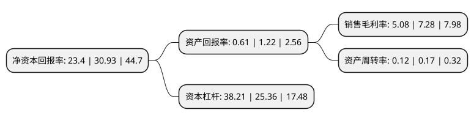

> 本页面由自动化程序生成于 2022年5月20日 01:03
> 内容可能存在错误，如有bug请提交issue至：https://github.com/Eroleice/doc-pi/issues
{.is-warning}

# 上市公司基本情况

## 基本资料

中交地产股份有限公司（以下简称“中交地产”）成立于1993年02月03日，重庆市。于1997年04月25日在深交所主板上市。

中交地产注册资本69,543.369万元，主营业务:房地产开发，经营以下是详细信息：

- 公司名称: 中交地产股份有限公司
- 股票代码: 000736.SZ
- 所在地: 重庆 - 重庆市
- 成立日期: 1993年02月03日
- 注册资本: 69,543.369万元
- 法定代表人: 李永前
- 主营业务: 主营业务:房地产开发，经营
- 公司官网: www.cccgrealestate.com
- 公司介绍: 公司是一家国有控股房地产上市公司。主营业务为房地产开发与经营。公司拥有多家子公司，业务拓展到包括房地产开发、工业地产经营、物业管理、高新企业投资等领域。公司具备十余年房地产开发经验，先后成功开发了业态涵盖住宅、别墅、商业、综合体的多个项目，公司作为中国交通建设集团有限公司在房地产板块唯一的A股上市平台，具备良好的企业背景及信用水平等条件，公司具备整体发展战略方向及资源优势，公司加大一、二线城市及有较大成长性城市布局力度的战略部署，从战略角度着手搭建资源建设平台，并同市场上的优势资源进行资源积极对接，保障主业持续发展和产业链延伸。

## 股东及高管情况

上市公司第一大股东为中交房地产集团有限公司，持股370,796,949股，占比53.32%，为上市公司实际控制人。

截至2022年04月12日，上市公司的前十大股东中，共有1名自然人股东，6名机构股东，3个产品账户，其中5%以上大股东共有4名。上市公司前十大股东明细如下：

> 截至2022年04月12日，上市公司前十大股东信息如下：

| 股东名称 | 持股数量（股） | 持股比例 |
| --- | --- | --- |
| 中交房地产集团有限公司 | 370,796,949 | 53.32% |
| 中交房地产集团有限公司 | 370,796,949 | 53.32% |
| 重庆渝富资本运营集团有限公司 | 62,338,880 | 8.964% |
| 重庆渝富资本运营集团有限公司 | 62,338,880 | 8.96% |
| 湖南华夏投资集团有限公司 | 30,515,561 | 4.39% |
| 西安紫薇地产开发有限公司 | 23,394,955 | 3.36% |
| 中国建设银行股份有限公司-广发价值领先混合型证券投资基金 | 14,332,157 | 2.06% |
| 彭程 | 10,524,696 | 1.51% |
| 交通银行-华夏蓝筹核心混合型证券投资基金(LOF) | 5,924,270 | 0.85% |
| 中国建设银行股份有限公司-华夏兴和混合型证券投资基金 | 4,855,245 | 0.7% |

## 利润表分析

上市公司2021年总收入为145.42亿元，净利润为7.39亿元，实现盈利。

## 杜邦分析

> 数据列示周期：2021年 | 2020年 | 2019年
{.is-info}

上市公司的净资产收益率在近一年有所下降，下降幅度为-24.35%，其变化情况分解如下：
- 上市公司的销售毛利率在近一年下降了-30.22%，可能是生产效率的下降、商品原材料价格上涨或商品价格的下跌所致。
- 上市公司的资产周转率在近一年下降了-29.41%，可能是源自于更慢的销售回款或库存管理效果下降。
- 上市公司的财务杠杆比率在近一年上升了50.67%，可能是增加负债扩大生产规模。

