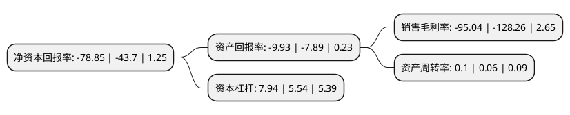

> 本页面由自动化程序生成于 2022年5月20日 01:04
> 内容可能存在错误，如有bug请提交issue至：https://github.com/Eroleice/doc-pi/issues
{.is-warning}

# 上市公司基本情况

## 基本资料

嘉凯城集团股份有限公司（以下简称“嘉凯城”）成立于1998年08月14日，杭州市。于1999年07月20日在深交所主板上市。

嘉凯城注册资本180,419.15万元，主营业务:房地产投资以下是详细信息：

- 公司名称: 嘉凯城集团股份有限公司
- 股票代码: 000918.SZ
- 所在地: 浙江 - 杭州市
- 成立日期: 1998年08月14日
- 注册资本: 180,419.15万元
- 法定代表人: 时守明
- 主营业务: 主营业务:房地产投资
- 公司官网: www.calxon-group.com
- 公司介绍: 公司是浙江省国资委旗下唯一的房产上市公司，2009年在深交所上市，营业收入达百亿，跻身中国房地产百强之列。公司具备多年的房地产开发及商业资产管理经验，已经成功开发了60余个中、高端房地产项目，产品线丰富，“城市之光”、“阳光城”等系列产品在业界极具影响力。同时，运营管理了多个大型商业项目，商业资源丰富，管理水平不断提升。公司紧跟国家政策，抓住新型城镇化发展先机，取得了在城镇商业领域的先发优势。旗下拥有“名镇天下”城镇商业运营品牌，建立了多个城镇商业发展平台，已经在江浙沪等地发展了一批特色城镇商业项目。

## 股东及高管情况

上市公司第一大股东为深圳市华建控股有限公司，持股539,453,259股，占比29.9%，**疑似为**上市公司实际控制人。

截至2022年05月09日，上市公司的前十大股东中，共有10名机构股东，其中5%以上大股东共有10名。上市公司前十大股东明细如下：

> 未能通过持股比例判定出上市公司实际控制人（持股30%以上）
> 可能存在通过间接持股、联合持股、协议控制等方式拥有实际控制权的主体，具体请参考上市公司定期公告！
{.is-warning}

> 截至2022年05月09日，上市公司前十大股东信息如下：

| 股东名称 | 持股数量（股） | 持股比例 |
| --- | --- | --- |
| 深圳市华建控股有限公司 | 539,453,259 | 29.9% |
| 深圳市华建控股有限公司 | 539,453,259 | 29.9% |
| 深圳市华建控股有限公司 | 539,453,259 | 29.9% |
| 深圳市华建控股有限公司 | 539,453,259 | 29.9% |
| 广州市凯隆置业有限公司 | 172,463,938 | 9.5591% |
| 广州市凯隆置业有限公司 | 154,422,038 | 8.5591% |
| 广州市凯隆置业有限公司 | 136,680,093 | 7.5757% |
| 浙江国大集团有限责任公司 | 115,940,000 | 6.43% |
| 浙江国大集团有限责任公司 | 115,940,000 | 6.43% |
| 浙江国大集团有限责任公司 | 115,940,000 | 6.43% |

## 利润表分析

上市公司2021年总收入为13.73亿元，净利润为-13.06亿元，**未实现盈利**。

## 杜邦分析

> 数据列示周期：2021年 | 2020年 | 2019年
{.is-info}

上市公司的净资产收益率在近一年有所上升，上升幅度为80.43%，其变化情况分解如下：
- 上市公司的销售毛利率在近一年下降了-25.9%，可能是生产效率的下降、商品原材料价格上涨或商品价格的下跌所致。
- 上市公司的资产周转率在近一年上升了66.67%，可能是源自于更快的销售回款或库存管理效果提升。
- 上市公司的财务杠杆比率在近一年上升了43.32%，可能是增加负债扩大生产规模。

