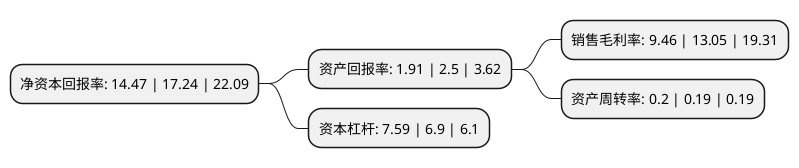

> 本页面由自动化程序生成于 2022年5月20日 01:05
> 内容可能存在错误，如有bug请提交issue至：https://github.com/Eroleice/doc-pi/issues
{.is-warning}

# 上市公司基本情况

## 基本资料

招商局蛇口工业区控股股份有限公司（以下简称“招商蛇口”）成立于1992年02月19日，深圳市。于2015年12月30日在深交所主板上市。

招商蛇口注册资本792,324.259万元，主营业务:园区开发与运营，社区开发与运营，邮轮产业建设与运营以下是详细信息：

- 公司名称: 招商局蛇口工业区控股股份有限公司
- 股票代码: 001979.SZ
- 所在地: 广东 - 深圳市
- 成立日期: 1992年02月19日
- 注册资本: 792,324.259万元
- 法定代表人: 许永军
- 主营业务: 主营业务:园区开发与运营，社区开发与运营，邮轮产业建设与运营
- 公司官网: www.cmsk1979.com
- 公司介绍: 公司是招商局集团(中央直接管理的国有重要骨干企业，中国香港四大中资企业之一)旗下城市综合开发运营板块的旗舰企业，是招商局集团在国内重要的核心资产整合及业务协同平台。公司致力于成为“中国领先的城市及园区综合开发和运营服务商”,确立了“前港-中区-后城”的开发模式，以“产、网、融、城一体化发展”为业务抓手，协同园区开发运营、社区开发运营、邮轮建设运营等三大业务，配套提供多元化的、覆盖全生命周期的产品与服务,包括：精品住宅、商业综合体、智慧及创意园区、片区产业带、邮轮母港、写字楼、酒店公寓、养老产品、长租公寓、健康医疗等，为城市发展与产业升级提供综合性的解决方案。

## 股东及高管情况

上市公司第一大股东为招商局集团有限公司，持股4,606,899,949股，占比58.14%，为上市公司实际控制人。

截至2022年03月31日，上市公司的前十大股东中，共有8名机构股东，1个产品账户，1个海外主体，其中5%以上大股东共有2名。上市公司前十大股东明细如下：

> 截至2022年03月31日，上市公司前十大股东信息如下：

| 股东名称 | 持股数量（股） | 持股比例 |
| --- | --- | --- |
| 招商局集团有限公司 | 4,606,899,949 | 58.14% |
| 招商局轮船有限公司 | 409,823,160 | 5.17% |
| 国新投资有限公司 | 170,036,084 | 2.15% |
| 香港中央结算有限公司(陆股通) | 163,459,941 | 2.06% |
| 北京诚通金控投资有限公司 | 162,003,396 | 2.04% |
| 中国人寿保险股份有限公司-传统-普通保险产品-005L-CT001深 | 119,535,941 | 1.51% |
| 中国证券金融股份有限公司 | 67,677,157 | 0.85% |
| 深圳华侨城股份有限公司 | 63,559,322 | 0.8% |
| 国开金融有限责任公司 | 63,559,322 | 0.8% |
| 北京奇点领誉一期投资中心(有限合伙) | 63,559,322 | 0.8% |

## 利润表分析

上市公司2021年总收入为1,606.43亿元，净利润为152.01亿元，实现盈利。

## 杜邦分析

> 数据列示周期：2021年 | 2020年 | 2019年
{.is-info}

上市公司的净资产收益率在近一年有所下降，下降幅度为-16.07%，其变化情况分解如下：
- 上市公司的销售毛利率在近一年下降了-27.51%，可能是生产效率的下降、商品原材料价格上涨或商品价格的下跌所致。
- 上市公司的资产周转率在近一年上升了5.26%，可能是源自于更快的销售回款或库存管理效果提升。
- 上市公司的财务杠杆比率在近一年上升了10%，可能是增加负债扩大生产规模。

