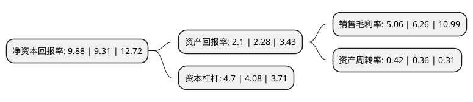

> 本页面由自动化程序生成于 2022年5月20日 01:06
> 内容可能存在错误，如有bug请提交issue至：https://github.com/Eroleice/doc-pi/issues
{.is-warning}

# 上市公司基本情况

## 基本资料

广宇集团股份有限公司（以下简称“广宇集团”）成立于2000年12月04日，杭州市。于2007年04月27日在深交所中小板上市。

广宇集团注册资本77,414.418万元，主营业务:房地产开发经营，商业物业经营。以下是详细信息：

- 公司名称: 广宇集团股份有限公司
- 股票代码: 002133.SZ
- 所在地: 浙江 - 杭州市
- 成立日期: 2000年12月04日
- 注册资本: 77,414.418万元
- 法定代表人: 王轶磊
- 主营业务: 主营业务:房地产开发经营，商业物业经营
- 公司官网: www.cosmosgroup.com.cn
- 公司介绍: 公司是一家具有一级房地产开发资质的房地产企业，是全国首家在国内A股IPO上市的民营房地产企业，先后荣获“中国房地产百强企业”、“中国房地产企业纳税50强”、“中国房地产诚信企业”等多项荣誉。公司建立了以杭州为中心，二、三线城市为重点的开发局面；在产品定位及设计理念方面，以开发高性价比的中小户型普通住宅为主导产品，保留一定比例的高端住宅产品，不断加强设计研发实力，将积累的高端产品的设计理念和经验优势引入到普通住宅的户型设计中，全面提高产品质量；在企业文化及人才战略方面，致力于成为学者型、研究型和实践型相结合的地产公司，通过人才培养，有力支持公司的异地扩张，实现管理模式和盈利模式的快速复制。在做好房地产业务的同时，公司结合行业及自身特点，在2015年研究确定将大健康事业作为公司发展的第二主业，力争使其成为公司发展新的增长点。

## 股东及高管情况

上市公司第一大股东为杭州平海投资有限公司，持股134,757,000股，占比17.41%，**疑似为**上市公司实际控制人。

截至2022年03月31日，上市公司的前十大股东中，共有6名自然人股东，4名机构股东，其中5%以上大股东共有2名。上市公司前十大股东明细如下：

> 未能通过持股比例判定出上市公司实际控制人（持股30%以上）
> 可能存在通过间接持股、联合持股、协议控制等方式拥有实际控制权的主体，具体请参考上市公司定期公告！
{.is-warning}

> 截至2022年03月31日，上市公司前十大股东信息如下：

| 股东名称 | 持股数量（股） | 持股比例 |
| --- | --- | --- |
| 杭州平海投资有限公司 | 134,757,000 | 17.41% |
| 王鹤鸣 | 74,150,737 | 9.58% |
| 杭州澜华投资管理有限公司 | 32,967,033 | 4.26% |
| 法泰达管理(杭州)有限公司 | 12,500,000 | 1.61% |
| 中国国际金融香港资产管理有限公司-客户资金2 | 7,002,187 | 0.9% |
| 单玲玲 | 6,867,620 | 0.89% |
| 王孝勤 | 6,664,300 | 0.86% |
| 李一文 | 6,010,112 | 0.78% |
| 周金振 | 5,250,050 | 0.68% |
| 单康康 | 5,020,000 | 0.65% |

## 利润表分析

上市公司2021年总收入为73.69亿元，净利润为3.72亿元，实现盈利。

## 杜邦分析

> 数据列示周期：2021年 | 2020年 | 2019年
{.is-info}

上市公司的净资产收益率在近一年有所上升，上升幅度为6.12%，其变化情况分解如下：
- 上市公司的销售毛利率在近一年下降了-19.17%，可能是生产效率的下降、商品原材料价格上涨或商品价格的下跌所致。
- 上市公司的资产周转率在近一年上升了16.67%，可能是源自于更快的销售回款或库存管理效果提升。
- 上市公司的财务杠杆比率在近一年上升了15.2%，可能是增加负债扩大生产规模。

