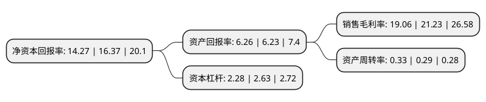

> 本页面由自动化程序生成于 2022年5月20日 01:24
> 内容可能存在错误，如有bug请提交issue至：https://github.com/Eroleice/doc-pi/issues
{.is-warning}

# 上市公司基本情况

## 基本资料

卧龙地产集团股份有限公司（以下简称“卧龙地产”）成立于1993年07月17日，绍兴市。于1999年04月15日在上交所主板上市。

卧龙地产注册资本70,050.624万元，主营业务:房地产开发经营和物业管理。以下是详细信息：

- 公司名称: 卧龙地产集团股份有限公司
- 股票代码: 600173.SH
- 所在地: 浙江 - 绍兴市
- 成立日期: 1993年07月17日
- 注册资本: 70,050.624万元
- 法定代表人: 王希全
- 主营业务: 主营业务:房地产开发经营和物业管理
- 公司官网: www.wolong-re.com
- 公司介绍: 公司是一家在上海证券交易所A股上市的房地产集团企业。公司主营房地产开发经营和物业管理，具有国家一级房地产开发资质，项目广泛分布在清远、武汉、绍兴、上虞、银川、青岛等国内经济发达城市。公司全面推行ISO9001:2008质量管理体系，导入OA自动化办公、CRM信息化管理系统，实现现代企业管理。公司开发的“卧龙·天香华庭”、“卧龙·天香西园”等几大系列楼盘均成为了当地地标性楼盘，赢得了广大消费者的喜爱和市场的充分肯定。公司秉承“打造精品楼盘，成就完美生活”的经营理念，先后获多项国家或地方奖项及荣誉称号。

## 股东及高管情况

上市公司第一大股东为浙江卧龙置业投资有限公司，持股314,104,357股，占比44.84%，为上市公司实际控制人。

截至2022年03月31日，上市公司的前十大股东中，共有7名自然人股东，3名机构股东，其中5%以上大股东共有2名。上市公司前十大股东明细如下：

> 截至2022年03月31日，上市公司前十大股东信息如下：

| 股东名称 | 持股数量（股） | 持股比例 |
| --- | --- | --- |
| 浙江卧龙置业投资有限公司 | 314,104,357 | 44.84% |
| 浙江龙盛集团股份有限公司 | 97,595,278 | 13.93% |
| 王杰 | 12,192,200 | 1.74% |
| 应丹丹 | 9,334,582 | 1.33% |
| 卧龙控股集团有限公司 | 8,184,610 | 1.17% |
| 朱伟 | 8,086,697 | 1.15% |
| 刘卫凯 | 7,559,000 | 1.08% |
| 叶兰芳 | 5,631,512 | 0.8% |
| 范一栋 | 5,494,700 | 0.78% |
| 杨藕珍 | 4,300,000 | 0.61% |

## 利润表分析

上市公司2021年总收入为25.03亿元，净利润为4.77亿元，实现盈利。

## 杜邦分析

> 数据列示周期：2021年 | 2020年 | 2019年
{.is-info}

上市公司的净资产收益率在近一年有所下降，下降幅度为-12.83%，其变化情况分解如下：
- 上市公司的销售毛利率在近一年下降了-10.22%，可能是生产效率的下降、商品原材料价格上涨或商品价格的下跌所致。
- 上市公司的资产周转率在近一年上升了13.79%，可能是源自于更快的销售回款或库存管理效果提升。
- 上市公司的财务杠杆比率在近一年下降了-13.31%，可能是减少负债降低财务费用。

