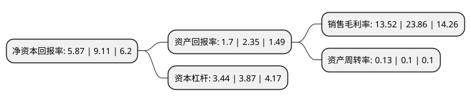

> 本页面由自动化程序生成于 2022年5月20日 01:25
> 内容可能存在错误，如有bug请提交issue至：https://github.com/Eroleice/doc-pi/issues
{.is-warning}

# 上市公司基本情况

## 基本资料

新湖中宝股份有限公司（以下简称“新湖中宝”）成立于1993年02月23日，衢州市。于1999年06月23日在上交所主板上市。

新湖中宝注册资本859,934.354万元，主要业务:地产开发以下是详细信息：

- 公司名称: 新湖中宝股份有限公司
- 股票代码: 600208.SH
- 所在地: 浙江 - 衢州市
- 成立日期: 1993年02月23日
- 注册资本: 859,934.354万元
- 法定代表人: 林俊波
- 主营业务: 地产开发
- 公司官网: www.600208.net
- 公司介绍: 公司于1999年在上海证券交易所上市，公司主营业务为地产、金融服务和金融科技。公司地产业务的规模、实力和品质居行业前列。近年来公司逐步加大了以上海内环为核心的环上海城市带的布局，同时在长三角投入一级土地开发，为地产业务可持续发展奠定坚实基础。公司持续构建金融服务和金融科技双向赋能的生态圈。拥有银行、证券、保险、期货、消费金融等多家金融机构的股权，是中信银行、温州银行、湘财证券、新湖期货、阳光保险等机构的主要参股股东。公司前瞻投资于区块链、大数据、人工智能、云计算等科技公司，是51信用卡、万得信息、邦盛科技和趣链科技等一批拥有领先技术和市场份额的金融科技公司的重要股东。

## 股东及高管情况

上市公司第一大股东为浙江新湖集团股份有限公司，持股2,786,910,170股，占比32.41%，为上市公司实际控制人。

截至2022年03月31日，上市公司的前十大股东中，共有1名自然人股东，5名机构股东，4个产品账户，其中5%以上大股东共有3名。上市公司前十大股东明细如下：

> 截至2022年03月31日，上市公司前十大股东信息如下：

| 股东名称 | 持股数量（股） | 持股比例 |
| --- | --- | --- |
| 浙江新湖集团股份有限公司 | 2,786,910,170 | 32.41% |
| 黄伟 | 1,449,967,233 | 16.86% |
| 宁波嘉源实业发展有限公司 | 462,334,913 | 5.38% |
| 中国证券金融股份有限公司 | 258,720,943 | 3.01% |
| 浙江恒兴力控股集团有限公司 | 209,991,540 | 2.44% |
| 中国北方工业有限公司 | 178,000,000 | 2.07% |
| 新湖中宝股份有限公司回购专用证券账户 | 165,454,236 | 1.92% |
| 华澳国际信托有限公司-华澳·臻智56号-新湖中宝员工持股计划集合资金信托计划 | 67,892,734 | 0.79% |
| 嘉实基金-农业银行-嘉实中证金融资产管理计划 | 26,439,823 | 0.31% |
| 银华基金-农业银行-银华中证金融资产管理计划 | 23,295,554 | 0.27% |

## 杜邦分析

> 数据列示周期：2021年 | 2020年 | 2019年
{.is-info}

上市公司的净资产收益率在近一年有所下降，下降幅度为-35.57%，其变化情况分解如下：
- 上市公司的销售毛利率在近一年下降了-43.34%，可能是生产效率的下降、商品原材料价格上涨或商品价格的下跌所致。
- 上市公司的资产周转率在近一年上升了30%，可能是源自于更快的销售回款或库存管理效果提升。
- 上市公司的财务杠杆比率在近一年下降了-11.11%，可能是减少负债降低财务费用。

