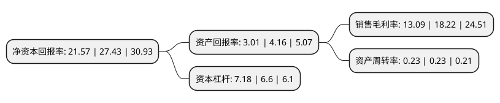

> 本页面由自动化程序生成于 2022年5月20日 01:26
> 内容可能存在错误，如有bug请提交issue至：https://github.com/Eroleice/doc-pi/issues
{.is-warning}

# 上市公司基本情况

## 基本资料

金地(集团)股份有限公司（以下简称“金地集团”）成立于1988年01月20日，深圳市。于2001年04月12日在上交所主板上市。

金地集团注册资本451,458.357万元，主要业务:房地产开发与经营，物业租赁和物业管理。以下是详细信息：

- 公司名称: 金地(集团)股份有限公司
- 股票代码: 600383.SH
- 所在地: 广东 - 深圳市
- 成立日期: 1988年01月20日
- 注册资本: 451,458.357万元
- 法定代表人: 凌克
- 主营业务: 房地产开发与经营，物业租赁和物业管理
- 公司官网: www.gemdale.com
- 公司介绍: 公司是中国最早上市并完成全国化布局的房地产企业之一。公司目前的业务包括住宅开发与销售及装修、商用地产开发与销售及持有运营、房地产金融、物业服务与社区经营、以网球为特色的国际教育及体育产业运营等。公司以“科学筑家”为使命，30年来秉持“科学筑家，智美精工”的产品理念，为中国家庭提供标准化、系列化的住宅与社区商业产品，是中国建设系统企业信誉AAA单位、房地产开发企业国家一级资质单位。以客户认可、市场认同、企业信誉和业绩为基础，公司获得多项殊荣。公司将以价值创造为目的，以效益与规模的平衡均好发展为导向，向“做中国最有价值的国际化企业”的宏伟愿景持续迈进。

## 股东及高管情况

上市公司第一大股东为富德生命人寿保险股份有限公司-万能H，持股979,419,165股，占比21.69%，**疑似为**上市公司实际控制人。

截至2022年03月31日，上市公司的前十大股东中，共有5名机构股东，4个产品账户，1个海外主体，其中5%以上大股东共有3名。上市公司前十大股东明细如下：

> 未能通过持股比例判定出上市公司实际控制人（持股30%以上）
> 可能存在通过间接持股、联合持股、协议控制等方式拥有实际控制权的主体，具体请参考上市公司定期公告！
{.is-warning}

> 截至2022年03月31日，上市公司前十大股东信息如下：

| 股东名称 | 持股数量（股） | 持股比例 |
| --- | --- | --- |
| 富德生命人寿保险股份有限公司-万能H | 979,419,165 | 21.69% |
| 深圳市福田投资控股有限公司 | 351,777,629 | 7.79% |
| 大家人寿保险股份有限公司-万能产品 | 245,151,325 | 5.43% |
| 富德生命人寿保险股份有限公司-万能G | 197,681,270 | 4.38% |
| 富德生命人寿保险股份有限公司-分红 | 169,889,373 | 3.76% |
| 中国证券金融股份有限公司 | 135,203,988 | 2.99% |
| 香港中央结算有限公司(陆股通) | 133,536,452 | 2.96% |
| 全国社保基金一一八组合 | 56,807,425 | 1.26% |
| 华润深国投信托有限公司-华润信托·晟利32号集合资金信托计划 | 45,500,000 | 1.01% |
| 全国社保基金四一三组合 | 26,683,310 | 0.59% |

## 利润表分析

上市公司2021年总收入为992.32亿元，净利润为129.51亿元，实现盈利。

## 杜邦分析

> 数据列示周期：2021年 | 2020年 | 2019年
{.is-info}

上市公司的净资产收益率在近一年有所下降，下降幅度为-21.36%，其变化情况分解如下：
- 上市公司的销售毛利率在近一年下降了-28.16%，可能是生产效率的下降、商品原材料价格上涨或商品价格的下跌所致。
- 上市公司的资产周转率在近一年下降了0%，可能是源自于更慢的销售回款或库存管理效果下降。
- 上市公司的财务杠杆比率在近一年上升了8.79%，可能是增加负债扩大生产规模。

