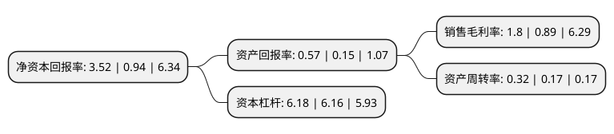

> 本页面由自动化程序生成于 2022年5月20日 01:28
> 内容可能存在错误，如有bug请提交issue至：https://github.com/Eroleice/doc-pi/issues
{.is-warning}

# 上市公司基本情况

## 基本资料

光明房地产集团股份有限公司（以下简称“光明地产”）成立于1993年01月04日，上海市。于1996年06月06日在上交所主板上市。

光明地产注册资本222,863.674万元，主营业务:房地产综合开发经营，物流产业链以下是详细信息：

- 公司名称: 光明房地产集团股份有限公司
- 股票代码: 600708.SH
- 所在地: 上海 - 上海市
- 成立日期: 1993年01月04日
- 注册资本: 222,863.674万元
- 法定代表人: 沈宏泽
- 主营业务: 主营业务:房地产综合开发经营，物流产业链
- 公司官网: www.bre600708.com
- 公司介绍: 公司是集房产开发、施工、物业、冷链物流及产业链等为一体的国内大型国有综合房地产集团型公司。主营业务为房地产综合开发经营、物流产业链，目前，公司拥有下属企业一百多家，下属房产开发、商业房产经营集团、物流集团、建筑施工企业(一级)、物业管理(一级)等。公司开发足迹遍布江苏、浙江、安徽、广西、河南、山东、湖南、湖北、上海等八省一市。公司及其前身农房集团连续多年荣膺“中国房地产开发企业100强”、“中国房地产开发稳健经营10强”。下属房产项目公司依靠自身优秀的产品品质和过硬的工程管理，获得上海市建设工程“白玉兰”奖、“上海市五一劳动奖状”等。

## 股东及高管情况

上市公司第一大股东为光明食品(集团)有限公司，持股784,975,129股，占比35.22%，为上市公司实际控制人。

截至2022年03月31日，上市公司的前十大股东中，共有3名自然人股东，5名机构股东，2个产品账户，其中5%以上大股东共有2名。上市公司前十大股东明细如下：

> 截至2022年03月31日，上市公司前十大股东信息如下：

| 股东名称 | 持股数量（股） | 持股比例 |
| --- | --- | --- |
| 光明食品(集团)有限公司 | 784,975,129 | 35.22% |
| 上海大都市资产经营管理有限公司 | 358,249,294 | 16.07% |
| 上海信达汇融股权投资基金管理有限公司-宁波沁融股权投资合伙企业(有限合伙) | 40,245,438 | 1.81% |
| 邦信资产管理有限公司 | 38,245,438 | 1.72% |
| 广西铁路发展投资基金(有限合伙) | 37,999,000 | 1.71% |
| 杨捷 | 22,271,206 | 1% |
| 陈克春 | 19,515,500 | 0.88% |
| 上海益民食品一厂(集团)有限公司 | 15,436,841 | 0.69% |
| 中信证券股份有限公司 | 13,412,658 | 0.6% |
| 叶利其 | 12,912,400 | 0.58% |

## 利润表分析

上市公司2021年总收入为258.79亿元，净利润为4.65亿元，实现盈利。

## 杜邦分析

> 数据列示周期：2021年 | 2020年 | 2019年
{.is-info}

上市公司的净资产收益率在近一年有所上升，上升幅度为274.47%，其变化情况分解如下：
- 上市公司的销售毛利率在近一年上升了102.25%，可能是生产效率的提升、商品原材料价格下跌或商品价格的上涨所致。
- 上市公司的资产周转率在近一年上升了88.24%，可能是源自于更快的销售回款或库存管理效果提升。
- 上市公司的财务杠杆比率在近一年上升了0.32%，可能是增加负债扩大生产规模。

