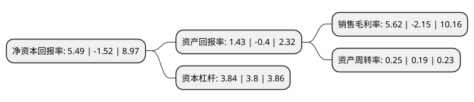

> 本页面由自动化程序生成于 2022年5月20日 01:28
> 内容可能存在错误，如有bug请提交issue至：https://github.com/Eroleice/doc-pi/issues
{.is-warning}

# 上市公司基本情况

## 基本资料

上海实业发展股份有限公司（以下简称“上实发展”）成立于1996年09月19日，上海市。于1996年09月25日在上交所主板上市。

上实发展注册资本184,456.289万元，主要业务:房屋租赁，上海之窗·御景园，郑州家和万世，重庆水天花园，重庆锦绣山庄，成都锦绣花园。以下是详细信息：

- 公司名称: 上海实业发展股份有限公司
- 股票代码: 600748.SH
- 所在地: 上海 - 上海市
- 成立日期: 1996年09月19日
- 注册资本: 184,456.289万元
- 法定代表人: 曾明
- 主营业务: 房屋租赁，上海之窗·御景园，郑州家和万世，重庆水天花园，重庆锦绣山庄，成都锦绣花园
- 公司官网: www.sidlgroup.com
- 公司介绍: 公司是上海市政府重点扶持的国有大型企业集团，公司坚持“坚守主业、适度多元”的发展战略，全方位拓展公司发展空间，促进公司可持续发展。在房地产主业的战略布局上，公司逐步建立以上海为核心、长三角、华东地区为主要目标的发展方针，进一步明确“1+3”的区域布局战略，即坚持以上海为核心，形成以上海为中心的长三角区域、青岛为中心的环渤海区域和成渝为中心的西南片区为3个深耕区域，保持主业循序稳进发展。公司房地产项目主要分布在上海、杭州、苏州、湖州、绍兴、泉州、青岛、成都、重庆、长沙等城市。在业务结构上，坚持以房地产开发、运营为主，辅以地产服务和新兴产业“一核多翼”多元发展的战略指导思路，以金融地产、文化地产、养老产业等产业地产作为运作平台，深度挖掘房地产细分领域实现产业升级；以智慧城市、联合办公、健康养老等新兴产业作为产业延伸，实现与地产主业的跨界融合，提升多元产业的能级。

## 股东及高管情况

上市公司第一大股东为上实地产发展有限公司，持股896,435,864股，占比48.6%，为上市公司实际控制人。

截至2021年12月31日，上市公司的前十大股东中，共有1名自然人股东，7名机构股东，2个产品账户，其中5%以上大股东共有2名。上市公司前十大股东明细如下：

> 截至2021年12月31日，上市公司前十大股东信息如下：

| 股东名称 | 持股数量（股） | 持股比例 |
| --- | --- | --- |
| 上实地产发展有限公司 | 896,435,864 | 48.6% |
| 上海上投资产经营有限公司 | 111,779,879 | 6.06% |
| 君证(宁波梅山保税港区)股权投资合伙企业(有限合伙) | 66,908,443 | 3.63% |
| 中国长城资产管理股份有限公司 | 31,770,459 | 1.72% |
| 上海工业投资(集团)有限公司 | 26,441,700 | 1.43% |
| 上银基金-浦发银行-上海国盛(集团)有限公司 | 21,883,398 | 1.19% |
| 上海迎水投资管理有限公司-迎水文龙私募证券投资基金 | 19,709,003 | 1.07% |
| 中央汇金资产管理有限责任公司 | 16,775,950 | 0.91% |
| 上海上实投资管理咨询有限公司 | 11,853,660 | 0.64% |
| 郑满珊 | 11,144,160 | 0.6% |

## 利润表分析

上市公司2021年总收入为102.69亿元，净利润为5.76亿元，实现盈利。

## 杜邦分析

> 数据列示周期：2021年 | 2020年 | 2019年
{.is-info}

上市公司的净资产收益率在近一年有所下降，下降幅度为-461.18%，其变化情况分解如下：
- 上市公司的销售毛利率在近一年下降了-361.4%，可能是生产效率的下降、商品原材料价格上涨或商品价格的下跌所致。
- 上市公司的资产周转率在近一年上升了31.58%，可能是源自于更快的销售回款或库存管理效果提升。
- 上市公司的财务杠杆比率在近一年上升了1.05%，可能是增加负债扩大生产规模。

