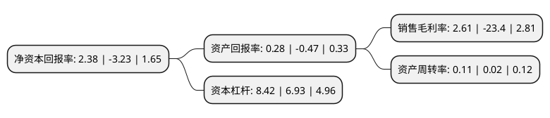

> 本页面由自动化程序生成于 2022年5月20日 01:29
> 内容可能存在错误，如有bug请提交issue至：https://github.com/Eroleice/doc-pi/issues
{.is-warning}

# 上市公司基本情况

## 基本资料

京能置业股份有限公司（以下简称“京能置业”）成立于1997年04月01日，北京市。于1997年01月30日在上交所主板上市。

京能置业注册资本45,288万元，主营业务为房地产开发与经营。以下是详细信息：

- 公司名称: 京能置业股份有限公司
- 股票代码: 600791.SH
- 所在地: 北京 - 北京市
- 成立日期: 1997年04月01日
- 注册资本: 45,288万元
- 法定代表人: 昝荣师
- 主营业务: 主营业务为房地产开发与经营
- 公司官网: www.beh-zy.com
- 公司介绍: 公司主营房地产开发与经营，拥有十余年的房地产开发经验，拥有一套较为完善的房地产开发和管理模式，形成了稳定专业的房地产开发团队。公司目前主要从事北京、银川和天津等地区的房地产开发业务，经营模式为房产开发型。公司以房地产开发业务为主，具备一级开发资质。

## 股东及高管情况

上市公司第一大股东为北京能源集团有限责任公司，持股204,983,645股，占比45.26%，为上市公司实际控制人。

截至2022年03月31日，上市公司的前十大股东中，共有8名自然人股东，2名机构股东，其中5%以上大股东共有1名。上市公司前十大股东明细如下：

> 截至2022年03月31日，上市公司前十大股东信息如下：

| 股东名称 | 持股数量（股） | 持股比例 |
| --- | --- | --- |
| 北京能源集团有限责任公司 | 204,983,645 | 45.26% |
| 李惠球 | 3,380,000 | 0.75% |
| 陈建纲 | 3,061,900 | 0.68% |
| 贵州省技术改造投资有限责任公司 | 2,030,000 | 0.45% |
| 张瑞 | 2,000,000 | 0.44% |
| 何小春 | 1,945,299 | 0.43% |
| 王超 | 1,448,700 | 0.32% |
| 吴明武 | 1,389,346 | 0.31% |
| 廖国钊 | 1,165,000 | 0.26% |
| 许伟德 | 1,101,800 | 0.24% |

## 利润表分析

上市公司2021年总收入为21.32亿元，净利润为0.55亿元，实现盈利。

## 杜邦分析

> 数据列示周期：2021年 | 2020年 | 2019年
{.is-info}

上市公司的净资产收益率在近一年有所下降，下降幅度为-173.68%，其变化情况分解如下：
- 上市公司的销售毛利率在近一年下降了-111.15%，可能是生产效率的下降、商品原材料价格上涨或商品价格的下跌所致。
- 上市公司的资产周转率在近一年上升了450%，可能是源自于更快的销售回款或库存管理效果提升。
- 上市公司的财务杠杆比率在近一年上升了21.5%，可能是增加负债扩大生产规模。

