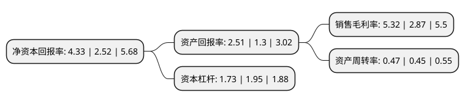

> 本页面由自动化程序生成于 2022年5月20日 01:10
> 内容可能存在错误，如有bug请提交issue至：https://github.com/Eroleice/doc-pi/issues
{.is-warning}

# 上市公司基本情况

## 基本资料

湖北三峡旅游集团股份有限公司（以下简称“三峡旅游”）成立于1998年08月10日，宜昌市。于2011年11月03日在深交所中小板上市。

三峡旅游注册资本73,814.812万元，主营业务旅客运输服务，汽车经销。本公司的旅客运输业务具备水陆联运一体化的优势，为旅客提供公路，水路中转“零换乘”服务，形成了集道路客运，水上客运，旅游客运，客运港站服务为一体的多元化客运服务能力。以下是详细信息：

- 公司名称: 湖北三峡旅游集团股份有限公司
- 股票代码: 002627.SZ
- 所在地: 湖北 - 宜昌市
- 成立日期: 1998年08月10日
- 注册资本: 73,814.812万元
- 法定代表人: 殷俊
- 主营业务: 主营业务旅客运输服务，汽车经销本公司的旅客运输业务具备水陆联运一体化的优势，为旅客提供公路，水路中转“零换乘”服务，形成了集道路客运，水上客运，旅游客运，客运港站服务为一体的多元化客运服务能力
- 公司官网: www.ycjyjt.com
- 公司介绍: 公司为中国道路运输协会评定的道路旅客运输一级企业，交通部重点联系企业，连续多年“中国道路运输百强诚信企业”之一。公司的主营业务为旅客运输服务、汽车经销两大领域，其中旅客运输服务为公司的核心业务，涵盖了道路客运、长江水上高速客运及汽车客运站、港口站务服务。经过多年发展公司形成了集道路客运、水上客运、旅游客运、客运港站服务为一体的多元化客运服务能力。

## 股东及高管情况

上市公司第一大股东为宜昌交通旅游产业发展集团有限公司，持股169,531,564股，占比22.97%，**疑似为**上市公司实际控制人。

截至2022年03月31日，上市公司的前十大股东中，共有9名机构股东，1个产品账户，其中5%以上大股东共有2名。上市公司前十大股东明细如下：

> 未能通过持股比例判定出上市公司实际控制人（持股30%以上）
> 可能存在通过间接持股、联合持股、协议控制等方式拥有实际控制权的主体，具体请参考上市公司定期公告！
{.is-warning}

> 截至2022年03月31日，上市公司前十大股东信息如下：

| 股东名称 | 持股数量（股） | 持股比例 |
| --- | --- | --- |
| 宜昌交通旅游产业发展集团有限公司 | 169,531,564 | 22.97% |
| 三峡资本控股有限责任公司 | 41,753,653 | 5.66% |
| 湖北省鄂旅投创业投资有限责任公司 | 27,297,102 | 3.7% |
| 同程网络科技股份有限公司 | 21,315,240 | 2.89% |
| 宜昌国有资本投资控股集团有限公司 | 14,919,979 | 2.02% |
| 宜昌高新投资开发有限公司 | 14,919,978 | 2.02% |
| 宜昌城市建设投资控股集团有限公司 | 14,919,977 | 2.02% |
| 深圳市大华信安资产管理企业(有限合伙)-信安成长一号私募证券投资基金 | 11,500,000 | 1.56% |
| 宜昌道行文旅开发有限公司 | 11,198,000 | 1.52% |
| 宜昌交旅投资开发有限公司 | 10,834,596 | 1.47% |

## 利润表分析

上市公司2021年总收入为21.78亿元，净利润为1.15亿元，实现盈利。

## 杜邦分析

> 数据列示周期：2021年 | 2020年 | 2019年
{.is-info}

上市公司的净资产收益率在近一年有所上升，上升幅度为71.83%，其变化情况分解如下：
- 上市公司的销售毛利率在近一年上升了85.37%，可能是生产效率的提升、商品原材料价格下跌或商品价格的上涨所致。
- 上市公司的资产周转率在近一年上升了4.44%，可能是源自于更快的销售回款或库存管理效果提升。
- 上市公司的财务杠杆比率在近一年下降了-11.28%，可能是减少负债降低财务费用。

