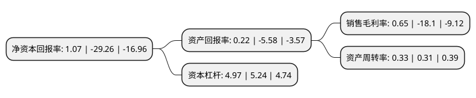

> 本页面由自动化程序生成于 2022年5月20日 01:27
> 内容可能存在错误，如有bug请提交issue至：https://github.com/Eroleice/doc-pi/issues
{.is-warning}

# 上市公司基本情况

## 基本资料

江西长运股份有限公司（以下简称“江西长运”）成立于1995年03月10日，南昌市。于2002年07月16日在上交所主板上市。

江西长运注册资本28,447.68万元，主要业务:公路旅客运输，旅游服务，车辆租赁。以下是详细信息：

- 公司名称: 江西长运股份有限公司
- 股票代码: 600561.SH
- 所在地: 江西 - 南昌市
- 成立日期: 1995年03月10日
- 注册资本: 28,447.68万元
- 法定代表人: 王晓
- 主营业务: 公路旅客运输，旅游服务，车辆租赁
- 公司官网: www.jxcy.com.cn
- 公司介绍: 公司是中国道路旅客运输一级企业，主要从事公路客运、旅游服务、物流服务、出租客运、公交客运、汽车销售与租赁、车辆检测与修理、物业管理、石油销售等业务，基本形成了以江西南昌、景德镇、吉安、新余、抚州、萍乡、安徽马鞍山、黄山为中心，覆盖江西及相关营运区域并迅速向周边延伸的公路运输服务网络。公司坚持以客运业务为核心，依托资本运营进行横向一体化扩张促进企业规模化、集约化、网络化发展，同时通过精细化管理建立“低成本、高效率”的运营模式，打造中国道路运输行业自主创新的优质企业品牌。

## 股东及高管情况

上市公司第一大股东为江西长运集团有限公司，持股65,676,853股，占比23.09%，**疑似为**上市公司实际控制人。

截至2022年03月31日，上市公司的前十大股东中，共有7名自然人股东，3名机构股东，其中5%以上大股东共有2名。上市公司前十大股东明细如下：

> 未能通过持股比例判定出上市公司实际控制人（持股30%以上）
> 可能存在通过间接持股、联合持股、协议控制等方式拥有实际控制权的主体，具体请参考上市公司定期公告！
{.is-warning}

> 截至2022年03月31日，上市公司前十大股东信息如下：

| 股东名称 | 持股数量（股） | 持股比例 |
| --- | --- | --- |
| 江西长运集团有限公司 | 65,676,853 | 23.09% |
| 南昌市政公用投资控股有限责任公司 | 47,412,800 | 16.67% |
| 原俊锋 | 2,351,000 | 0.83% |
| 王行宙 | 1,955,484 | 0.69% |
| 章丽萍 | 1,800,000 | 0.63% |
| 吴晓春 | 1,739,730 | 0.61% |
| 吴晓春 | 1,739,730 | 0.61% |
| 雷晓芳 | 1,689,484 | 0.59% |
| 单晓方 | 1,330,900 | 0.47% |
| 江西省投资集团有限公司 | 1,282,595 | 0.45% |

## 利润表分析

上市公司2021年总收入为18.17亿元，净利润为0.11亿元，实现盈利。

## 杜邦分析

> 数据列示周期：2021年 | 2020年 | 2019年
{.is-info}

上市公司的净资产收益率在近一年有所下降，下降幅度为-103.66%，其变化情况分解如下：
- 上市公司的销售毛利率在近一年下降了-103.59%，可能是生产效率的下降、商品原材料价格上涨或商品价格的下跌所致。
- 上市公司的资产周转率在近一年上升了6.45%，可能是源自于更快的销售回款或库存管理效果提升。
- 上市公司的财务杠杆比率在近一年下降了-5.15%，可能是减少负债降低财务费用。

