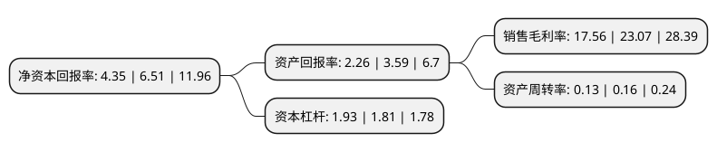

> 本页面由自动化程序生成于 2022年5月20日 01:27
> 内容可能存在错误，如有bug请提交issue至：https://github.com/Eroleice/doc-pi/issues
{.is-warning}

# 上市公司基本情况

## 基本资料

大众交通(集团)股份有限公司（以下简称“大众交通”）成立于1994年06月06日，上海市。于1992年08月07日在上交所主板上市。

大众交通注册资本236,412.286万元，主营业务:运输业，旅游饮食，服务业，商业，工业。以下是详细信息：

- 公司名称: 大众交通(集团)股份有限公司
- 股票代码: 600611.SH
- 所在地: 上海 - 上海市
- 成立日期: 1994年06月06日
- 注册资本: 236,412.286万元
- 法定代表人: 杨国平
- 主营业务: 主营业务:运输业，旅游饮食，服务业，商业，工业
- 公司官网: WWW.96822.COM
- 公司介绍: 公司前身为上海市大众出租汽车公司，目前已成为上海最大的公交集团之一。公司逐步形成了以城市综合交通服务等产业为主体，以房地产业、金融及股权投资产业为两翼的集团化发展格局。公司旗下大众出租公司、大众租车公司、大众物流公司、大众国旅和交通大众等业内领先企业，积极投身世博，分别为世博出租汽车供应、高端会务接待、世博园区物流配送和长三角世博体验之旅提供高品质服务。大众出租开展“2015质量管理年”并通过“上海名牌”复评。

## 股东及高管情况

上市公司第一大股东为上海大众公用事业(集团)股份有限公司，持股473,186,074股，占比20.01%，**疑似为**上市公司实际控制人。

截至2022年03月31日，上市公司的前十大股东中，共有2名自然人股东，2名机构股东，2个产品账户，4个海外主体，其中5%以上大股东共有1名。上市公司前十大股东明细如下：

> 未能通过持股比例判定出上市公司实际控制人（持股30%以上）
> 可能存在通过间接持股、联合持股、协议控制等方式拥有实际控制权的主体，具体请参考上市公司定期公告！
{.is-warning}

> 截至2022年03月31日，上市公司前十大股东信息如下：

| 股东名称 | 持股数量（股） | 持股比例 |
| --- | --- | --- |
| 上海大众公用事业(集团)股份有限公司 | 473,186,074 | 20.01% |
| Fretum Construction & Engineering Enterprise Limited | 111,499,006 | 4.72% |
| 大众交通(集团)股份有限公司-第一期员工持股计划 | 87,976,193 | 3.72% |
| 大众(香港)国际有限公司 | 47,676,295 | 2.02% |
| VANGUARD EMERGING MARKETS STOCK INDEX FUND | 14,483,176 | 0.61% |
| VANGUARD TOTAL INTERNATIONAL STOCK INDEX FUND | 10,955,524 | 0.46% |
| NORGES BANK | 10,136,184 | 0.43% |
| 刘伟 | 9,459,600 | 0.4% |
| 李传元 | 9,287,829 | 0.39% |
| 温州启元资产管理有限公司-启元尊享3号私募证券投资基金 | 8,800,000 | 0.37% |

## 利润表分析

上市公司2021年总收入为23.45亿元，净利润为3.77亿元，实现盈利。

## 杜邦分析

> 数据列示周期：2021年 | 2020年 | 2019年
{.is-info}

上市公司的净资产收益率在近一年有所下降，下降幅度为-33.18%，其变化情况分解如下：
- 上市公司的销售毛利率在近一年下降了-23.88%，可能是生产效率的下降、商品原材料价格上涨或商品价格的下跌所致。
- 上市公司的资产周转率在近一年下降了-18.75%，可能是源自于更慢的销售回款或库存管理效果下降。
- 上市公司的财务杠杆比率在近一年上升了6.63%，可能是增加负债扩大生产规模。

