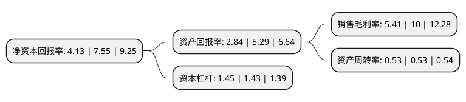

> 本页面由自动化程序生成于 2022年5月20日 01:28
> 内容可能存在错误，如有bug请提交issue至：https://github.com/Eroleice/doc-pi/issues
{.is-warning}

# 上市公司基本情况

## 基本资料

上海锦江在线网络服务股份有限公司（以下简称“锦江在线”）成立于1993年02月24日，上海市。于1993年06月07日在上交所主板上市。

锦江在线注册资本55,161.011万元，主要产品:客房及其他，餐饮，商场，客运，物流。以下是详细信息：

- 公司名称: 上海锦江在线网络服务股份有限公司
- 股票代码: 600650.SH
- 所在地: 上海 - 上海市
- 成立日期: 1993年02月24日
- 注册资本: 55,161.011万元
- 法定代表人: 许铭
- 主营业务: 主要产品:客房及其他，餐饮，商场，客运，物流
- 公司官网: www.jjtz.com
- 公司介绍: 公司主业是客运业和物流业，客运业主要包括出租车业务、租赁车业务和汽车修理业务，物流业务主要包括国际货运代理业务、机场货运站仓储业务和第三方物流业务。公司汽车综合接待能力处于行业领先水平，出租车业务、服务及经营水平名列行业前茅。公司租赁车业务是上海业内龙头，在国宾和大型国际会议接待用车市场排名第一。公司下属的锦海捷亚物流管理公司的机场仓储业务发展势头迅猛，与上海机场集团、德国汉莎航空公司三方合作的机场一期货运站运行良好。公司将以合资合作经营、兼并收购、委托经营管理等方式，立足上海，将优势产业向全国各经济中心城市的出租汽车、长途客运、汽车租赁市场，以及国内国际进出口货物的空运、海运和快件运输代理业务延伸，并通过证券市场平台，以股权转让、国内外合资等资本运作方式拓展核心产业、培育新新产业，实现服务区域突破、服务品种突破、对外合作突破、业务规模突破、盈利水平突破，做强企业、做大产业、做响品牌，实现“全国旅游客运业第一”的目标。

## 股东及高管情况

上市公司第一大股东为上海锦江资本股份有限公司，持股212,586,460股，占比38.54%，为上市公司实际控制人。

截至2022年03月31日，上市公司的前十大股东中，共有2名自然人股东，4名机构股东，4个海外主体，其中5%以上大股东共有1名。上市公司前十大股东明细如下：

> 截至2022年03月31日，上市公司前十大股东信息如下：

| 股东名称 | 持股数量（股） | 持股比例 |
| --- | --- | --- |
| 上海锦江资本股份有限公司 | 212,586,460 | 38.54% |
| 招商证券香港有限公司 | 4,791,526 | 0.87% |
| 上海锦江饭店有限公司 | 3,761,493 | 0.68% |
| VANGUARD TOTAL INTERNATIONAL STOCK INDEX FUND | 2,109,352 | 0.38% |
| VANGUARD EMERGING MARKETS STOCK INDEX FUND | 1,742,110 | 0.32% |
| 上海锦江汽车服务有限公司(工会) | 1,600,000 | 0.29% |
| 张永光 | 1,426,908 | 0.26% |
| 赵莉 | 1,423,600 | 0.26% |
| DEBORAH WANG LIN | 1,300,000 | 0.24% |
| SPDR Portfolio Emerging Markets ETF | 1,286,274 | 0.23% |

## 利润表分析

上市公司2021年总收入为27.14亿元，净利润为1.46亿元，实现盈利。

## 杜邦分析

> 数据列示周期：2021年 | 2020年 | 2019年
{.is-info}

上市公司的净资产收益率在近一年有所下降，下降幅度为-45.3%，其变化情况分解如下：
- 上市公司的销售毛利率在近一年下降了-45.9%，可能是生产效率的下降、商品原材料价格上涨或商品价格的下跌所致。
- 上市公司的资产周转率在近一年下降了0%，可能是源自于更慢的销售回款或库存管理效果下降。
- 上市公司的财务杠杆比率在近一年上升了1.4%，可能是增加负债扩大生产规模。

