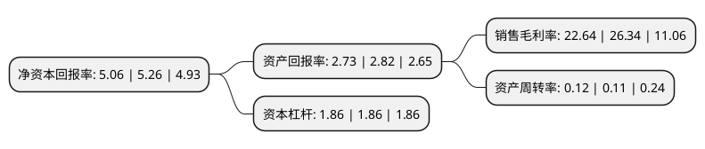

> 本页面由自动化程序生成于 2022年5月20日 01:29
> 内容可能存在错误，如有bug请提交issue至：https://github.com/Eroleice/doc-pi/issues
{.is-warning}

# 上市公司基本情况

## 基本资料

上海申通地铁股份有限公司（以下简称“申通地铁”）成立于1992年06月12日，上海市。于1994年02月24日在上交所主板上市。

申通地铁注册资本47,738.191万元，主要业务:地铁运营。以下是详细信息：

- 公司名称: 上海申通地铁股份有限公司
- 股票代码: 600834.SH
- 所在地: 上海 - 上海市
- 成立日期: 1992年06月12日
- 注册资本: 47,738.191万元
- 法定代表人: 叶彤
- 主营业务: 地铁运营
- 公司官网: www.shtmetro.com
- 公司介绍: 公司是我国境内从事轨道交通投资经营的上市公司，主要从事上海地铁一号线(莘庄站-上海火车站站)经营业务，以及融资租赁业务。一号线是其中投入运营最早、经济效益最好的一条黄金线路，日均客运量在上海所有轨道交通线中位列第一。随着上海轨道交通网络化的逐步形成，公司客流量已经并将进一步表现出良好的增长潜力。公司将继续提供优质城市公共产品，保障城市运行，实现社会效益最大化。同时，公司将集中精力控制成本上升速度，关注新线开通对公司的影响，使地铁一号线经营继续保持稳定局面。公司将规范、稳健经营，满足乘客需求，提升城市生活品质。关心员工成长，不断增强企业核心竞争力。拓展融资租赁业务深度和广度，增加公司收益。充分发挥公司在资本市场的作用，为上海轨道交通长期可持续发展做出贡献。

## 股东及高管情况

上市公司第一大股东为上海申通地铁集团有限公司，持股278,943,799股，占比58.43%，为上市公司实际控制人。

截至2022年03月31日，上市公司的前十大股东中，共有6名自然人股东，2名机构股东，1个产品账户，1个海外主体，其中5%以上大股东共有1名。上市公司前十大股东明细如下：

> 截至2022年03月31日，上市公司前十大股东信息如下：

| 股东名称 | 持股数量（股） | 持股比例 |
| --- | --- | --- |
| 上海申通地铁集团有限公司 | 278,943,799 | 58.43% |
| 上海城投控股股份有限公司 | 8,334,469 | 1.75% |
| WANG XINLI | 2,885,000 | 0.6% |
| 中国工商银行股份有限公司-中证上海国企交易型开放式指数证券投资基金 | 2,399,566 | 0.5% |
| 王新力 | 1,620,000 | 0.34% |
| 王之祥 | 900,000 | 0.19% |
| 张素英 | 660,000 | 0.14% |
| 丁兴标 | 643,600 | 0.13% |
| 钟永雄 | 640,000 | 0.13% |
| 苏子佑 | 628,600 | 0.13% |

## 利润表分析

上市公司2021年总收入为3.48亿元，净利润为0.78亿元，实现盈利。

## 杜邦分析

> 数据列示周期：2021年 | 2020年 | 2019年
{.is-info}

上市公司的净资产收益率在近一年有所下降，下降幅度为-3.8%，其变化情况分解如下：
- 上市公司的销售毛利率在近一年下降了-14.05%，可能是生产效率的下降、商品原材料价格上涨或商品价格的下跌所致。
- 上市公司的资产周转率在近一年上升了9.09%，可能是源自于更快的销售回款或库存管理效果提升。
- 上市公司的财务杠杆比率在近一年下降了0%，可能是减少负债降低财务费用。

