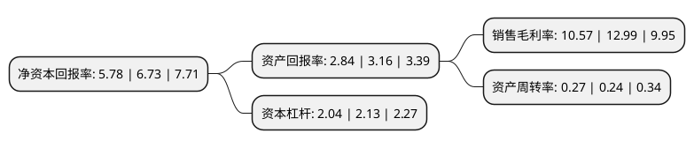

> 本页面由自动化程序生成于 2022年5月20日 01:08
> 内容可能存在错误，如有bug请提交issue至：https://github.com/Eroleice/doc-pi/issues
{.is-warning}

# 上市公司基本情况

## 基本资料

四川富临运业集团股份有限公司（以下简称“富临运业”）成立于2002年03月18日，绵阳市。于2010年02月10日在深交所中小板上市。

富临运业注册资本31,348.904万元，主营业务:汽车客运站经营和汽车客，货运输;公司主要提供汽车客运站服务和汽车客，货运输服务。以下是详细信息：

- 公司名称: 四川富临运业集团股份有限公司
- 股票代码: 002357.SZ
- 所在地: 四川 - 绵阳市
- 成立日期: 2002年03月18日
- 注册资本: 31,348.904万元
- 法定代表人: 董和玉
- 主营业务: 主营业务:汽车客运站经营和汽车客，货运输;公司主要提供汽车客运站服务和汽车客，货运输服务
- 公司官网: www.scflyy.cn
- 公司介绍: 公司是专业从事公路运输的国家道路旅客运输一级企业、中国道路运输百强企业、国家一级道路旅客运质量信誉AAA级企业。主营业务以客运服务、站务服务为主业，以出租车经营、城市公交车经营、汽车维修、驾驶员培训和保险兼业代理等相关附属配套产业为辅，为社会大众提供安全、舒适、方便、快捷的大型、专业化运输服务。公司先后获得“百强诚信客运站”、“道路运输一级企业”、高速直达班车获省“工人先锋号”、“全国道路百强诚信客运站”等荣誉称号。

## 股东及高管情况

上市公司第一大股东为永锋集团有限公司，持股93,733,221股，占比29.9%，**疑似为**上市公司实际控制人。

截至2022年03月31日，上市公司的前十大股东中，共有5名自然人股东，2名机构股东，2个产品账户，1名其他股东，其中5%以上大股东共有1名。上市公司前十大股东明细如下：

> 未能通过持股比例判定出上市公司实际控制人（持股30%以上）
> 可能存在通过间接持股、联合持股、协议控制等方式拥有实际控制权的主体，具体请参考上市公司定期公告！
{.is-warning}

> 截至2022年03月31日，上市公司前十大股东信息如下：

| 股东名称 | 持股数量（股） | 持股比例 |
| --- | --- | --- |
| 永锋集团有限公司 | 93,733,221 | 29.9% |
| 法国兴业银行 | 2,139,860 | 0.68% |
| 张庆生 | 1,776,500 | 0.57% |
| 上海迎水投资管理有限公司-行知星享迎水晋泰8号私募证券投资基金 | 1,572,200 | 0.5% |
| 张天虚 | 1,518,900 | 0.48% |
| 华泰证券股份有限公司 | 1,320,779 | 0.42% |
| 中国民生银行股份有限公司-金元顺安元启灵活配置混合型证券投资基金 | 1,200,000 | 0.38% |
| 杨庆 | 1,165,000 | 0.37% |
| 钱磊 | 1,140,300 | 0.36% |
| 陈玉琼 | 1,125,900 | 0.36% |

## 利润表分析

上市公司2021年总收入为6.96亿元，净利润为0.73亿元，实现盈利。

## 杜邦分析

> 数据列示周期：2021年 | 2020年 | 2019年
{.is-info}

上市公司的净资产收益率在近一年有所下降，下降幅度为-14.12%，其变化情况分解如下：
- 上市公司的销售毛利率在近一年下降了-18.63%，可能是生产效率的下降、商品原材料价格上涨或商品价格的下跌所致。
- 上市公司的资产周转率在近一年上升了12.5%，可能是源自于更快的销售回款或库存管理效果提升。
- 上市公司的财务杠杆比率在近一年下降了-4.23%，可能是减少负债降低财务费用。

