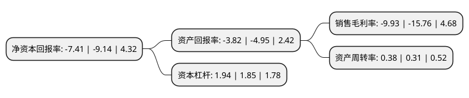

> 本页面由自动化程序生成于 2022年5月20日 01:32
> 内容可能存在错误，如有bug请提交issue至：https://github.com/Eroleice/doc-pi/issues
{.is-warning}

# 上市公司基本情况

## 基本资料

海南海汽运输集团股份有限公司（以下简称“海汽集团”）成立于1985年11月28日，海口市。于2016年07月12日在上交所主板上市。

海汽集团注册资本31,600万元，主营业务:致力于道路旅客运输业务，主要从事汽车客运，汽车客运站经营以及与之相关的汽车销售，维修与检测，汽车器材与燃油料销售等业务，自设立以来公司的主营业务未发生过变化。以下是详细信息：

- 公司名称: 海南海汽运输集团股份有限公司
- 股票代码: 603069.SH
- 所在地: 海南 - 海口市
- 成立日期: 1985年11月28日
- 注册资本: 31,600万元
- 法定代表人: 刘海荣
- 主营业务: 主营业务:致力于道路旅客运输业务，主要从事汽车客运，汽车客运站经营以及与之相关的汽车销售，维修与检测，汽车器材与燃油料销售等业务，自设立以来公司的主营业务未发生过变化
- 公司官网: www.0898hq.com
- 公司介绍: 公司是全国道路客运一级企业、全国道路客运50强企业、中国交通业百强企业，海南道路运输业龙头企业，也是海南最大型的道路运输综合服务提供商,业务领域涵盖班线客运、旅游客运、出租、快递、汽车维修等。自成立以来，一直致力于道路旅客运输业务，主要从事汽车客运、汽车客运站经营以及与之相关的汽车销售与维修、汽车器材与燃油料销售等业务。汽车客运及汽车客运站经营是公司的核心业务。目前公司的汽车客运业务已形成了班线客运、旅游客运、出租车客运等多方位的道路客运服务能力。公司拥有道路客运一级经营资质，2004年通过了ISO9001:2000质量管理体系认证；公司先后通过了ISO9001:2008质量管理体系认证、国家标准化管理委员会的审核验收，成为全国交通运输服务标准化试点单位。

## 股东及高管情况

上市公司第一大股东为海南海汽投资控股有限公司，持股134,300,000股，占比42.5%，为上市公司实际控制人。

截至2022年03月31日，上市公司的前十大股东中，共有1名自然人股东，7名机构股东，2个产品账户，其中5%以上大股东共有2名。上市公司前十大股东明细如下：

> 截至2022年03月31日，上市公司前十大股东信息如下：

| 股东名称 | 持股数量（股） | 持股比例 |
| --- | --- | --- |
| 海南海汽投资控股有限公司 | 134,300,000 | 42.5% |
| 海南高速公路股份有限公司 | 43,897,300 | 13.89% |
| 海南省农垦投资控股集团有限公司 | 2,427,000 | 0.77% |
| 海南海钢集团有限公司 | 2,420,000 | 0.77% |
| 海南海峡航运股份有限公司 | 2,370,000 | 0.75% |
| 华泰证券股份有限公司 | 2,025,445 | 0.64% |
| 中国对外经济贸易信托有限公司-昀沣证券投资集合资金信托计划 | 846,000 | 0.27% |
| 段其军 | 800,200 | 0.25% |
| 中国对外经济贸易信托有限公司-外贸信托-昀沣12号证券投资集合资金信托计划 | 780,000 | 0.25% |
| 新疆泰盛鑫融投资有限公司 | 662,200 | 0.21% |

## 利润表分析

上市公司2021年总收入为7.32亿元，净利润为-0.73亿元，**未实现盈利**。

## 杜邦分析

> 数据列示周期：2021年 | 2020年 | 2019年
{.is-info}

上市公司的净资产收益率在近一年有所下降，下降幅度为-18.93%，其变化情况分解如下：
- 上市公司的销售毛利率在近一年下降了-36.99%，可能是生产效率的下降、商品原材料价格上涨或商品价格的下跌所致。
- 上市公司的资产周转率在近一年上升了22.58%，可能是源自于更快的销售回款或库存管理效果提升。
- 上市公司的财务杠杆比率在近一年上升了4.86%，可能是增加负债扩大生产规模。

