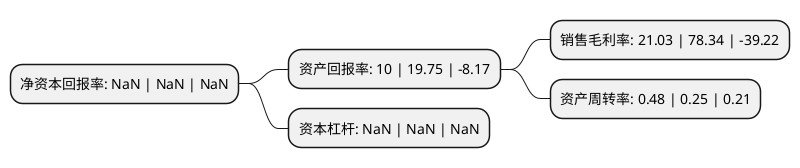

> 本页面由自动化程序生成于 2022年5月20日 01:02
> 内容可能存在错误，如有bug请提交issue至：https://github.com/Eroleice/doc-pi/issues
{.is-warning}

# 上市公司基本情况

## 基本资料

东北电气发展股份有限公司（以下简称“东电退”）成立于1998年05月13日，海口市。于1995年12月13日在深交所主板上市。

东电退注册资本87,337万元，主要业务:电力电容器，封闭母线等系统保护及传输设备的制造和营销。主要产品:高压开关，电力电容器，封闭母线，客房，餐饮，娱乐行业。以下是详细信息：

- 公司名称: 东北电气发展股份有限公司
- 股票代码: 000585.SZ
- 所在地: 海南 - 海口市
- 成立日期: 1998年05月13日
- 注册资本: 87,337万元
- 法定代表人: 尚多旭
- 主营业务: 电力电容器，封闭母线等系统保护及传输设备的制造和营销主要产品:高压开关，电力电容器，封闭母线，客房，餐饮，娱乐行业
- 公司官网: www.nee.com.cn
- 公司介绍: 公司是中国输变电设备科研、制造、出口的主要基地，国内输变电设备的主要供应商之一。公司主导产品为高压油浸并联电力电容器、干式自愈式并联电容器、电容式电压互感器、电容器成套装置、滤波电容器、耦合电容器、特种电容器、自冷封闭母线、配电变压器等系统保护及传输设备。主导产品国内市场覆盖率90%以上，产品出口20多个国家和地区，享有良好的市场信誉,主要的控股子公司均为行业骨干企业。公司主导产品荣获国家、部委、省市各级权威机构的奖励，并在同行业率先建立了“为用户服务制度”。所有产品可按国家标准(GB)、国际电工委员会标准(IEC)和德、美、日、英等发达国家标准生产，并已通过ISO9001:2008国际质量体系认证和复查，2011年财务年度起公司按照《企业内部控制基本规范》、《企业内部控制应用指引》在主要控股子公司全面建立并施行内部控制管理。

## 股东及高管情况

上市公司第一大股东为香港中央结算(代理人)有限公司，持股257,119,899股，占比29.44%，**疑似为**上市公司实际控制人。

截至2022年03月31日，上市公司的前十大股东中，共有7名自然人股东，2名机构股东，1个海外主体，其中5%以上大股东共有2名。上市公司前十大股东明细如下：

> 未能通过持股比例判定出上市公司实际控制人（持股30%以上）
> 可能存在通过间接持股、联合持股、协议控制等方式拥有实际控制权的主体，具体请参考上市公司定期公告！
{.is-warning}

> 截至2022年03月31日，上市公司前十大股东信息如下：

| 股东名称 | 持股数量（股） | 持股比例 |
| --- | --- | --- |
| 香港中央结算(代理人)有限公司 | 257,119,899 | 29.44% |
| 北京海鸿源投资管理有限公司 | 81,494,850 | 9.33% |
| 王娟 | 7,000,200 | 0.8% |
| 赵睿 | 6,255,600 | 0.72% |
| 张思佳 | 4,079,078 | 0.47% |
| 傅连军 | 3,974,489 | 0.46% |
| 史宇波 | 3,827,936 | 0.44% |
| 李慧 | 3,580,000 | 0.41% |
| 深圳中达软件开发公司 | 3,550,000 | 0.41% |
| 徐莉蓉 | 3,471,150 | 0.4% |

## 利润表分析

上市公司2021年总收入为0.83亿元，净利润为0.17亿元，实现盈利。

## 杜邦分析

> 数据列示周期：2021年 | 2020年 | 2019年
{.is-info}

上市公司的净资产收益率在近一年有所下降，下降幅度为NaN%，其变化情况分解如下：
- 上市公司的销售毛利率在近一年下降了-73.16%，可能是生产效率的下降、商品原材料价格上涨或商品价格的下跌所致。
- 上市公司的资产周转率在近一年上升了92%，可能是源自于更快的销售回款或库存管理效果提升。
- 上市公司的财务杠杆比率在近一年下降了NaN%，可能是减少负债降低财务费用。

