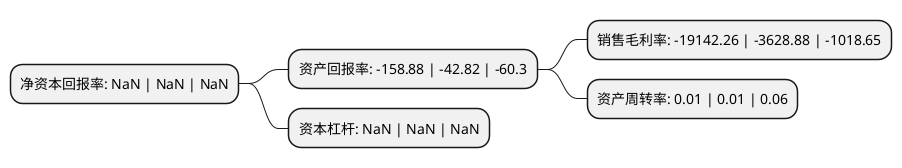

> 本页面由自动化程序生成于 2022年5月20日 01:04
> 内容可能存在错误，如有bug请提交issue至：https://github.com/Eroleice/doc-pi/issues
{.is-warning}

# 上市公司基本情况

## 基本资料

长城国际动漫游戏股份有限公司（以下简称“长动退”）成立于1994年01月19日，成都市。于1999年06月25日在深交所主板上市。

长动退注册资本32,676.037万元，主要产品或提供的劳务:游戏产品，动漫产品，动漫衍生品，旅游产品。以下是详细信息：

- 公司名称: 长城国际动漫游戏股份有限公司
- 股票代码: 000835.SZ
- 所在地: 四川 - 成都市
- 成立日期: 1994年01月19日
- 注册资本: 32,676.037万元
- 法定代表人: 袁同苏
- 主营业务: 主要产品或提供的劳务:游戏产品，动漫产品，动漫衍生品，旅游产品
- 公司官网: www.000835.com
- 公司介绍: 公司的前身为“四川圣达实业股份有限公司”，拥有四川圣达焦化有限公司和攀枝花市圣达焦化有限公司两家独立焦化企业。2014年7月长城影视文化企业集团有限公司通过股权协议转让的方式成功入主，成为公司第一大股东，并随之进行了一系列的并购重组。公司从主营生产销售焦炭系列产品的传统行业转型成为涵盖动漫设计、制作、动漫游戏、创意旅游和玩具销售等动漫业务的大型文化类企业，进军动漫原创及衍生品领域。公司致力于打造动漫游戏全产业链，产业领域涵盖动漫游戏原创内容研发、ip库授权、渠道发行、衍生品开发和线上线下虚拟实景体验。目前公司下辖宏梦卡通集团、东方国龙动漫、宣城科技、新娱兄弟，天芮经贸玩具等多家全资子公司，公司立足于建设动漫游戏首屈一指的跨区域跨平台产业集群，打造东方迪斯尼。公司的第一大股东长城影视文化企业集团是专注于电视剧投资、制作、发行及广告等衍生业务的文化创意企业，全国较大的影视传媒机构之一。

## 股东及高管情况

上市公司第一大股东为大洲娱乐股份有限公司，持股46,144,000股，占比14.12%，**疑似为**上市公司实际控制人。

截至2022年05月10日，上市公司的前十大股东中，共有5名自然人股东，5名机构股东，其中5%以上大股东共有5名。上市公司前十大股东明细如下：

> 未能通过持股比例判定出上市公司实际控制人（持股30%以上）
> 可能存在通过间接持股、联合持股、协议控制等方式拥有实际控制权的主体，具体请参考上市公司定期公告！
{.is-warning}

> 截至2022年05月10日，上市公司前十大股东信息如下：

| 股东名称 | 持股数量（股） | 持股比例 |
| --- | --- | --- |
| 大洲娱乐股份有限公司 | 46,144,000 | 14.12% |
| 大洲娱乐股份有限公司 | 46,144,000 | 14.12% |
| 大洲娱乐股份有限公司 | 46,144,000 | 14.12% |
| 方正证券股份有限公司 | 22,790,000 | 6.97% |
| 方正证券股份有限公司 | 21,390,000 | 6.5461% |
| 汤勇峰 | 1,947,900 | 0.6% |
| 王明 | 1,651,100 | 0.51% |
| 张宜元 | 1,483,500 | 0.45% |
| 曹子杰 | 1,186,401 | 0.36% |
| 吴士看 | 1,159,547 | 0.35% |

## 利润表分析

上市公司2021年总收入为0.02亿元，净利润为-4.54亿元，**未实现盈利**。

## 杜邦分析

> 数据列示周期：2021年 | 2020年 | 2019年
{.is-info}

上市公司的净资产收益率在近一年有所下降，下降幅度为NaN%，其变化情况分解如下：
- 上市公司的销售毛利率在近一年上升了427.5%，可能是生产效率的提升、商品原材料价格下跌或商品价格的上涨所致。
- 上市公司的资产周转率在近一年下降了0%，可能是源自于更慢的销售回款或库存管理效果下降。
- 上市公司的财务杠杆比率在近一年下降了NaN%，可能是减少负债降低财务费用。

