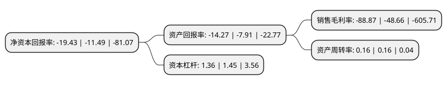

> 本页面由自动化程序生成于 2022年5月20日 01:23
> 内容可能存在错误，如有bug请提交issue至：https://github.com/Eroleice/doc-pi/issues
{.is-warning}

# 上市公司基本情况

## 基本资料

北京诺思兰德生物技术股份有限公司（以下简称“诺思兰德”）成立于2004年06月03日，北京市。于2020年11月24日在北交所北交所上市。

诺思兰德注册资本25,725.02万元，基因工程蛋白质类药物，基因治疗药物和眼科用药物的研发，生产及销售以下是详细信息：

- 公司名称: 北京诺思兰德生物技术股份有限公司
- 股票代码: 430047.BJ
- 所在地: 北京 - 北京市
- 成立日期: 2004年06月03日
- 注册资本: 25,725.02万元
- 法定代表人: 许松山
- 主营业务: 基因工程蛋白质类药物，基因治疗药物和眼科用药物的研发，生产及销售
- 公司官网: www.northland-bio.com
- 公司介绍: 公司的主营业务是专门从事生物新药研发、技术转让及技术服务。目前公司正在有序的推进新药产品研发及产业化。为此，公司计划以技术创新为动力，临床治疗需求为导向，完善药物研发体系，不断实现和增加经营收入，加快科技成果的商品化和产业化，未来将实现由新药研发为主向生物药品研发、生产、销售为一体的生物制药企业的战略转变。

## 股东及高管情况

上市公司第一大股东为许松山，持股36,566,730股，占比14.2145%，**疑似为**上市公司实际控制人。

截至2022年03月31日，上市公司的前十大股东中，共有7名自然人股东，2名机构股东，1个产品账户，其中5%以上大股东共有4名。上市公司前十大股东明细如下：

> 未能通过持股比例判定出上市公司实际控制人（持股30%以上）
> 可能存在通过间接持股、联合持股、协议控制等方式拥有实际控制权的主体，具体请参考上市公司定期公告！
{.is-warning}

> 截至2022年03月31日，上市公司前十大股东信息如下：

| 股东名称 | 持股数量（股） | 持股比例 |
| --- | --- | --- |
| 许松山 | 36,566,730 | 14.2145% |
| 许日山 | 29,325,957 | 11.3998% |
| 聂李亚 | 17,675,951 | 6.8711% |
| 许成日 | 15,532,008 | 6.0377% |
| 李相哲 | 12,842,708 | 4.9923% |
| 马素永 | 9,373,650 | 3.6438% |
| 武汉启迪东湖创业投资有限公司 | 5,700,000 | 2.2157% |
| 中国银行股份有限公司-富国积极成长一年定期开放混合型证券投资基金 | 4,348,504 | 1.6904% |
| 沈超英 | 3,688,888 | 1.434% |
| 北京爱科时代科技有限公司 | 3,610,000 | 1.4033% |

## 利润表分析

上市公司2021年总收入为0.56亿元，净利润为-0.51亿元，**未实现盈利**。

## 杜邦分析

> 数据列示周期：2021年 | 2020年 | 2019年
{.is-info}

上市公司的净资产收益率在近一年有所上升，上升幅度为69.1%，其变化情况分解如下：
- 上市公司的销售毛利率在近一年上升了82.63%，可能是生产效率的提升、商品原材料价格下跌或商品价格的上涨所致。
- 上市公司的资产周转率在近一年下降了0%，可能是源自于更慢的销售回款或库存管理效果下降。
- 上市公司的财务杠杆比率在近一年下降了-6.21%，可能是减少负债降低财务费用。

