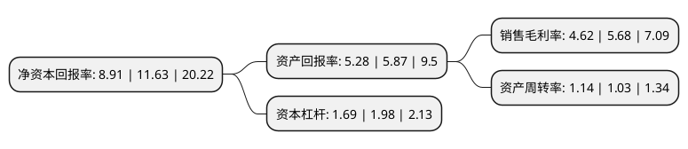

> 本页面由自动化程序生成于 2022年5月20日 01:23
> 内容可能存在错误，如有bug请提交issue至：https://github.com/Eroleice/doc-pi/issues
{.is-warning}

# 上市公司基本情况

## 基本资料

同辉佳视(北京)信息技术股份有限公司（以下简称“同辉信息”）成立于2008年07月31日，北京市。于2021年08月09日在北交所北交所上市。

同辉信息注册资本15,333.35万元，公司主营业务为向金融，展览展示，教育，影院等各行业用户提供领先的视觉综合解决方案及产品。以下是详细信息：

- 公司名称: 同辉佳视(北京)信息技术股份有限公司
- 股票代码: 430090.BJ
- 所在地: 北京 - 北京市
- 成立日期: 2008年07月31日
- 注册资本: 15,333.35万元
- 法定代表人: 戴福昊
- 主营业务: 公司主营业务为向金融，展览展示，教育，影院等各行业用户提供领先的视觉综合解决方案及产品
- 公司官网: www.bjb.com.cn
- 公司介绍: 公司通过了ISO9001-2008质量体系认证，在多媒体视频解决方案的研发、组装及系统集成服务方面具备标准化的质量控制体系，公司加入了北京中关村企业信用促进会、北京中关村高新技术企业协会、北京软件行业协会、北京民营科技实业家协会，在行业中具备一定的影响力，。目前公司已在高端视频墙和室外液晶数字标牌领域占据了较强的市场地位，尤其是在传媒与能源行业，知名度较高。公司在商用显示解决方案领域树立起自己的口碑和品牌。

## 股东及高管情况

上市公司第一大股东为戴福昊，持股33,941,533股，占比22.14%，**疑似为**上市公司实际控制人。

截至2022年03月31日，上市公司的前十大股东中，共有7名自然人股东，3名机构股东，其中5%以上大股东共有2名。上市公司前十大股东明细如下：

> 未能通过持股比例判定出上市公司实际控制人（持股30%以上）
> 可能存在通过间接持股、联合持股、协议控制等方式拥有实际控制权的主体，具体请参考上市公司定期公告！
{.is-warning}

> 截至2022年03月31日，上市公司前十大股东信息如下：

| 股东名称 | 持股数量（股） | 持股比例 |
| --- | --- | --- |
| 戴福昊 | 33,941,533 | 22.14% |
| 崔振英 | 9,718,770 | 6.34% |
| 李刚 | 6,846,855 | 4.47% |
| 赵庚飞 | 6,014,633 | 3.92% |
| 麻燕利 | 3,865,951 | 2.52% |
| 上海英大投资有限公司 | 2,485,272 | 1.62% |
| 东营聚昇新材料有限公司 | 2,470,000 | 1.61% |
| 宁波梅山保税港区泽成投资合伙企业(有限合伙) | 2,018,028 | 1.32% |
| 王彦杰 | 1,980,000 | 1.29% |
| 李文才 | 1,396,080 | 0.91% |

## 利润表分析

上市公司2021年总收入为5.66亿元，净利润为0.26亿元，实现盈利。

## 杜邦分析

> 数据列示周期：2021年 | 2020年 | 2019年
{.is-info}

上市公司的净资产收益率在近一年有所下降，下降幅度为-23.39%，其变化情况分解如下：
- 上市公司的销售毛利率在近一年下降了-18.66%，可能是生产效率的下降、商品原材料价格上涨或商品价格的下跌所致。
- 上市公司的资产周转率在近一年上升了10.68%，可能是源自于更快的销售回款或库存管理效果提升。
- 上市公司的财务杠杆比率在近一年下降了-14.65%，可能是减少负债降低财务费用。

