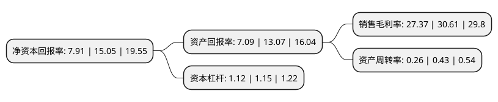

> 本页面由自动化程序生成于 2022年5月20日 01:23
> 内容可能存在错误，如有bug请提交issue至：https://github.com/Eroleice/doc-pi/issues
{.is-warning}

# 上市公司基本情况

## 基本资料

武汉微创光电股份有限公司（以下简称“微创光电”）成立于2001年08月15日，武汉市。于2020年07月27日在北交所北交所上市。

微创光电注册资本12,412.606万元，以视频为核心的监控信息化产品和解决方案以下是详细信息：

- 公司名称: 武汉微创光电股份有限公司
- 股票代码: 430198.BJ
- 所在地: 湖北 - 武汉市
- 成立日期: 2001年08月15日
- 注册资本: 12,412.606万元
- 法定代表人: 陈军
- 主营业务: 以视频为核心的监控信息化产品和解决方案
- 公司官网: www.wtoe.cn
- 公司介绍: 公司主要从事智慧交通领域中以视频为核心的高速公路监控信息化产品的研发、生产、销售及技术服务。智慧交通是在智能交通的基础上，充分运用物联网、云计算、互联网、人工智能、自动控制、移动互联网等技术，通过汇集交通信息，对交通管理、交通运输、公众出行等领域以及交通建设管理全过程进行管控支撑，使交通系统在区域、城市甚至更大的时空范围具备感知、互联、分析、预测、控制等能力，以充分保障交通安全、发挥交通基础设施效能、提升交通系统运行效率和管理水平，为通畅的公众出行和可持续的经济发展服务。

## 股东及高管情况

上市公司第一大股东为陈军，持股9,769,360股，占比7.87%，**疑似为**上市公司实际控制人。

截至2022年03月31日，上市公司的前十大股东中，共有9名自然人股东，1个产品账户，其中5%以上大股东共有9名。上市公司前十大股东明细如下：

> 未能通过持股比例判定出上市公司实际控制人（持股30%以上）
> 可能存在通过间接持股、联合持股、协议控制等方式拥有实际控制权的主体，具体请参考上市公司定期公告！
{.is-warning}

> 上市公司第一大股东持股不超过10%，请检查是否存在公司控制权风险！
{.is-danger}

> 截至2022年03月31日，上市公司前十大股东信息如下：

| 股东名称 | 持股数量（股） | 持股比例 |
| --- | --- | --- |
| 陈军 | 9,769,360 | 7.87% |
| 卢余庆 | 9,205,423 | 7.42% |
| 朱小兵 | 8,626,543 | 6.95% |
| 王昀 | 8,626,543 | 6.95% |
| 李俊杰 | 8,626,541 | 6.95% |
| 童邡 | 8,590,543 | 6.92% |
| 崔广基 | 8,532,043 | 6.87% |
| 吴华 | 8,446,541 | 6.8% |
| 马辉 | 7,113,262 | 5.73% |
| 武汉智慧城市创业投资基金合伙企业(有限合伙) | 3,373,200 | 2.72% |

## 利润表分析

上市公司2021年总收入为1.53亿元，净利润为0.42亿元，实现盈利。

## 杜邦分析

> 数据列示周期：2021年 | 2020年 | 2019年
{.is-info}

上市公司的净资产收益率在近一年有所下降，下降幅度为-47.44%，其变化情况分解如下：
- 上市公司的销售毛利率在近一年下降了-10.58%，可能是生产效率的下降、商品原材料价格上涨或商品价格的下跌所致。
- 上市公司的资产周转率在近一年下降了-39.53%，可能是源自于更慢的销售回款或库存管理效果下降。
- 上市公司的财务杠杆比率在近一年下降了-2.61%，可能是减少负债降低财务费用。

