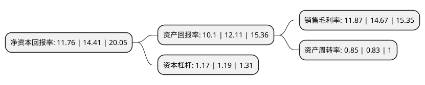

> 本页面由自动化程序生成于 2022年5月20日 01:23
> 内容可能存在错误，如有bug请提交issue至：https://github.com/Eroleice/doc-pi/issues
{.is-warning}

# 上市公司基本情况

## 基本资料

苏州轴承厂股份有限公司（以下简称“苏轴股份”）成立于1980年11月29日，苏州市。于2020年07月27日在北交所北交所上市。

苏轴股份注册资本8,060万元，轴承，滚动体等机电设备零部件的研发，生产及销售以下是详细信息：

- 公司名称: 苏州轴承厂股份有限公司
- 股票代码: 430418.BJ
- 所在地: 江苏 - 苏州市
- 成立日期: 1980年11月29日
- 注册资本: 8,060万元
- 法定代表人: 张文华
- 主营业务: 轴承，滚动体等机电设备零部件的研发，生产及销售
- 公司官网: www.sbfcn.com
- 公司介绍: 公司是滚针轴承、圆柱滚子轴承和滚针的专业设计与制造公司，江苏省高新技术企业。公司在上世纪六十年代初，即生产出了我国第一支滚针，七十年代主持起草了我国第一部滚针轴承行业标准，八十年代注册“中华”商标，九十年代被认定为江苏省第一批高新技术企业，公司于2008年被认定为国家高新技术企业并维持至今注册商标：“中华牌”“SZZH”。主要产品系列有冲压外圈滚针轴承、冲压外圈滚针离合器、圆柱滚子轴承、圆柱滚子离合器和球轴承组件、推力轴承、滚轮轴承、直线运动滚子导轨支承和滚动体等。

## 股东及高管情况

上市公司第一大股东为创元科技股份有限公司，持股34,485,000股，占比42.7854%，为上市公司实际控制人。

截至2022年03月31日，上市公司的前十大股东中，共有8名自然人股东，1名机构股东，1个产品账户，其中5%以上大股东共有1名。上市公司前十大股东明细如下：

> 截至2022年03月31日，上市公司前十大股东信息如下：

| 股东名称 | 持股数量（股） | 持股比例 |
| --- | --- | --- |
| 创元科技股份有限公司 | 34,485,000 | 42.7854% |
| 朱志浩 | 4,024,500 | 4.9932% |
| 潘国良 | 2,371,765 | 2.9426% |
| 张周花 | 2,004,217 | 2.4866% |
| 邹恒霞 | 1,869,100 | 2.319% |
| 张小玲 | 1,808,351 | 2.2436% |
| 傅勤衡 | 1,780,000 | 2.2084% |
| 苏州轴承厂股份有限公司二O一五年第一期员工持股计划 | 1,678,500 | 2.0825% |
| 彭君雄 | 1,669,600 | 2.0715% |
| 张文华 | 1,326,600 | 1.6459% |

## 利润表分析

上市公司2021年总收入为5.32亿元，净利润为0.63亿元，实现盈利。

## 杜邦分析

> 数据列示周期：2021年 | 2020年 | 2019年
{.is-info}

上市公司的净资产收益率在近一年有所下降，下降幅度为-18.39%，其变化情况分解如下：
- 上市公司的销售毛利率在近一年下降了-19.09%，可能是生产效率的下降、商品原材料价格上涨或商品价格的下跌所致。
- 上市公司的资产周转率在近一年上升了2.41%，可能是源自于更快的销售回款或库存管理效果提升。
- 上市公司的财务杠杆比率在近一年下降了-1.68%，可能是减少负债降低财务费用。

