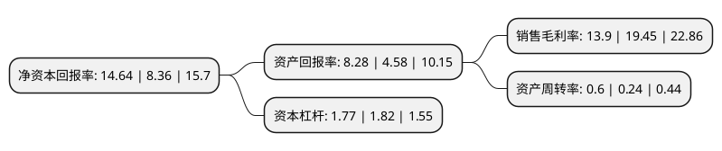

> 本页面由自动化程序生成于 2022年5月20日 01:23
> 内容可能存在错误，如有bug请提交issue至：https://github.com/Eroleice/doc-pi/issues
{.is-warning}

# 上市公司基本情况

## 基本资料

安徽佳先功能助剂股份有限公司（以下简称“佳先股份”）成立于2006年04月25日，蚌埠市。于2020年07月27日在北交所北交所上市。

佳先股份注册资本8,528.7万元，二苯甲酰甲烷，硬脂酰苯甲酰甲烷的生产，销售，自营上述产品的出口业务。以下是详细信息：

- 公司名称: 安徽佳先功能助剂股份有限公司
- 股票代码: 430489.BJ
- 所在地: 安徽 - 蚌埠市
- 成立日期: 2006年04月25日
- 注册资本: 8,528.7万元
- 法定代表人: 李兑
- 主营业务: 二苯甲酰甲烷，硬脂酰苯甲酰甲烷的生产，销售，自营上述产品的出口业务
- 公司官网: www.bbjx.com.cn
- 公司介绍: 公司是专业从事PVC环保热稳定剂助剂研发、生产和销售的高新技术企业，公司主营业务为生产、销售环保热稳定剂助剂，主要产品(β-二酮化合物)为DBM和SBM。公司是我国化工行业《二苯甲酰甲烷》、《硬脂酰苯甲酰甲烷》标准的主起草单位，先后被评为高新技术企业、国家火炬计划重点高新技术企业、国家火炬计划“硬脂酰苯甲酰甲烷”、“二苯甲酰甲烷”的项目承担单位、国家知识产权优势企业、国家科技型中小企业技术创新基金承担单位、安徽省专精特新中小企业、安徽省创新型企业、安徽省标准化示范企业等，拥有省认定企业技术中心、省级工程技术研究中心、省级博士后工作站。

## 股东及高管情况

上市公司第一大股东为蚌埠能源集团有限公司，持股23,400,001股，占比27.4368%，**疑似为**上市公司实际控制人。

截至2022年03月31日，上市公司的前十大股东中，共有3名自然人股东，7名机构股东，其中5%以上大股东共有2名。上市公司前十大股东明细如下：

> 未能通过持股比例判定出上市公司实际控制人（持股30%以上）
> 可能存在通过间接持股、联合持股、协议控制等方式拥有实际控制权的主体，具体请参考上市公司定期公告！
{.is-warning}

> 截至2022年03月31日，上市公司前十大股东信息如下：

| 股东名称 | 持股数量（股） | 持股比例 |
| --- | --- | --- |
| 蚌埠能源集团有限公司 | 23,400,001 | 27.4368% |
| 蚌埠中城创业投资有限公司 | 6,258,460 | 7.3381% |
| 国元证券股份有限公司 | 2,471,110 | 2.8974% |
| 蚌埠市远大创新创业投资有限公司 | 2,416,700 | 2.8336% |
| 石志勇 | 2,299,999 | 2.4974% |
| 国元证券股份有限公司 | 2,276,019 | 2.8974% |
| 石志勇 | 2,129,999 | 2.4974% |
| 喀什美迪克创业投资有限公司 | 1,472,000 | 1.6601% |
| 喀什美迪克创业投资有限公司 | 1,415,892 | 1.6601% |
| 王云 | 1,236,484 | 1.4719% |

## 利润表分析

上市公司2021年总收入为4.79亿元，净利润为0.66亿元，实现盈利。

## 杜邦分析

> 数据列示周期：2021年 | 2020年 | 2019年
{.is-info}

上市公司的净资产收益率在近一年有所上升，上升幅度为75.12%，其变化情况分解如下：
- 上市公司的销售毛利率在近一年下降了-28.53%，可能是生产效率的下降、商品原材料价格上涨或商品价格的下跌所致。
- 上市公司的资产周转率在近一年上升了150%，可能是源自于更快的销售回款或库存管理效果提升。
- 上市公司的财务杠杆比率在近一年下降了-2.75%，可能是减少负债降低财务费用。

