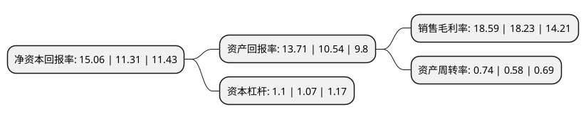

> 本页面由自动化程序生成于 2022年5月20日 01:23
> 内容可能存在错误，如有bug请提交issue至：https://github.com/Eroleice/doc-pi/issues
{.is-warning}

# 上市公司基本情况

## 基本资料

青岛丰光精密机械股份有限公司（以下简称“丰光精密”）成立于2001年07月19日，青岛市。于2020年12月28日在北交所北交所上市。

丰光精密注册资本13,158.138万元，半导体领域，工业自动化领域，汽车领域，轨道交通领域精密零部件的研发，生产与销售。以下是详细信息：

- 公司名称: 青岛丰光精密机械股份有限公司
- 股票代码: 430510.BJ
- 所在地: 山东 - 青岛市
- 成立日期: 2001年07月19日
- 注册资本: 13,158.138万元
- 法定代表人: 李军
- 主营业务: 半导体领域，工业自动化领域，汽车领域，轨道交通领域精密零部件的研发，生产与销售
- 公司官网: www.qdfg.cn
- 公司介绍: 公司成立于2001年7月，公司主营业务是研发、生产和销售精密机械加工件和压铸件，主要客户为高端装备制造、高速列车/轨道交通、汽车等行业的国内外知名品牌制造商。是一家以高端装备制造、高速列车/轨道交通、汽车零部件等行业的知名品牌制造商提供核心零部件的精密机械加工和压铸制造为核心技术和核心产品的中外合资企业。公司制造、加工的产品种类众多，其中最具代表性和竞争力的产品包括精密直线导轨滑块、高速列车减震器主件、伺服电机主轴、汽车安全带装置转轴、汽车发动机涨紧支臂。

## 股东及高管情况

上市公司第一大股东为青岛丰光投资管理有限公司，持股79,815,000股，占比60.66%，为上市公司实际控制人。

截至2022年04月06日，上市公司的前十大股东中，共有3名自然人股东，3名机构股东，4个产品账户，其中5%以上大股东共有6名。上市公司前十大股东明细如下：

> 截至2022年04月06日，上市公司前十大股东信息如下：

| 股东名称 | 持股数量（股） | 持股比例 |
| --- | --- | --- |
| 青岛丰光投资管理有限公司 | 79,815,000 | 60.66% |
| 青岛丰光投资管理有限公司 | 79,815,000 | 60.66% |
| 青岛鼎盛全投资企业(有限合伙) | 11,725,000 | 8.91% |
| 深圳市达晨创联股权投资基金合伙企业(有限合伙) | 9,999,500 | 7.6% |
| 国信(青岛胶州)股权投资基金合伙企业(有限合伙) | 7,291,474 | 5.5414% |
| 国信(青岛胶州)股权投资基金合伙企业(有限合伙) | 7,291,474 | 5.54% |
| 李德竹 | 732,018 | 0.55% |
| 青岛华资盛通股权投资基金合伙企业(有限合伙) | 667,705 | 0.51% |
| 黄劲平 | 380,000 | 0.29% |
| 黄劲平 | 378,000 | 0.29% |

## 利润表分析

上市公司2021年总收入为2.63亿元，净利润为0.48亿元，实现盈利。

## 杜邦分析

> 数据列示周期：2021年 | 2020年 | 2019年
{.is-info}

上市公司的净资产收益率在近一年有所上升，上升幅度为33.16%，其变化情况分解如下：
- 上市公司的销售毛利率在近一年上升了1.97%，可能是生产效率的提升、商品原材料价格下跌或商品价格的上涨所致。
- 上市公司的资产周转率在近一年上升了27.59%，可能是源自于更快的销售回款或库存管理效果提升。
- 上市公司的财务杠杆比率在近一年上升了2.8%，可能是增加负债扩大生产规模。

