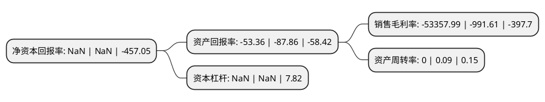

> 本页面由自动化程序生成于 2022年5月20日 01:36
> 内容可能存在错误，如有bug请提交issue至：https://github.com/Eroleice/doc-pi/issues
{.is-warning}

# 上市公司基本情况

## 基本资料

中新科技集团股份有限公司（以下简称“退中新”）成立于2007年05月23日，台州市。于2015年12月22日在上交所主板上市。

退中新注册资本30,015万元，主营业务:一直从事平板电视及平板电脑的研发，生产和销售，主要产品:分为平板电视与平板电脑两大类。以下是详细信息：

- 公司名称: 中新科技集团股份有限公司
- 股票代码: 603996.SH
- 所在地: 浙江 - 台州市
- 成立日期: 2007年05月23日
- 注册资本: 30,015万元
- 法定代表人: 周庭坚
- 主营业务: 主营业务:一直从事平板电视及平板电脑的研发，生产和销售，主要产品:分为平板电视与平板电脑两大类
- 公司官网: www.cncoptronics.cn
- 公司介绍: 公司是国内优秀的智能电子产品原始设计与研发制造商，自成立以来，公司始终专注于智能电视、笔记本电脑、平板电脑的产品研发、生产和销售。公司坚持以ODM模式和品牌销售的战略决策，产品销往全球各地。公司丰富的产品线以及较快的新产品推出速度，充分满足了客户对产品个性化需求。公司是国家高新技术企业，具有完整的研发生产和供应链管理能力，在全球行业企业中已处于较高水平。公司已制定了完善的研发管理制度，并专门成立了中新工程技术研究院有限公司专门负责公司的研发工作。公司将不断加大研发力度、鼓励产品和技术创新，推动公司由制造产品向创造产品的方向发展。

## 股东及高管情况

上市公司第一大股东为中新产业集团有限公司，持股55,000,000股，占比18.32%，**疑似为**上市公司实际控制人。

截至2022年03月31日，上市公司的前十大股东中，共有7名自然人股东，3名机构股东，其中5%以上大股东共有2名。上市公司前十大股东明细如下：

> 未能通过持股比例判定出上市公司实际控制人（持股30%以上）
> 可能存在通过间接持股、联合持股、协议控制等方式拥有实际控制权的主体，具体请参考上市公司定期公告！
{.is-warning}

> 截至2022年03月31日，上市公司前十大股东信息如下：

| 股东名称 | 持股数量（股） | 持股比例 |
| --- | --- | --- |
| 中新产业集团有限公司 | 55,000,000 | 18.32% |
| 陈德松 | 21,656,250 | 7.22% |
| 陈庆桃 | 5,082,100 | 1.69% |
| 周学森 | 4,067,500 | 1.36% |
| 崇仁县星联链科技有限公司 | 2,950,000 | 0.98% |
| 傅萌萌 | 1,893,600 | 0.63% |
| 董世佳 | 1,836,100 | 0.61% |
| 福州卓创传媒有限公司 | 1,828,800 | 0.61% |
| 李艺 | 1,676,600 | 0.56% |
| 曹迪厚 | 1,602,700 | 0.53% |

## 利润表分析

上市公司2021年总收入为0亿元，净利润为-4.3亿元，**未实现盈利**。

## 杜邦分析

> 数据列示周期：2021年 | 2020年 | 2019年
{.is-info}

上市公司的净资产收益率在近一年有所下降，下降幅度为NaN%，其变化情况分解如下：
- 上市公司的销售毛利率在近一年上升了5280.95%，可能是生产效率的提升、商品原材料价格下跌或商品价格的上涨所致。
- 上市公司的资产周转率在近一年下降了-100%，可能是源自于更慢的销售回款或库存管理效果下降。
- 上市公司的财务杠杆比率在近一年下降了NaN%，可能是减少负债降低财务费用。

