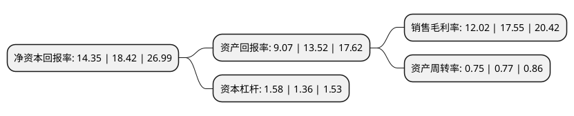

> 本页面由自动化程序生成于 2022年5月20日 01:40
> 内容可能存在错误，如有bug请提交issue至：https://github.com/Eroleice/doc-pi/issues
{.is-warning}

# 上市公司基本情况

## 基本资料

上海艾融软件股份有限公司（以下简称“艾融软件”）成立于2009年03月24日，上海市。于2020年07月27日在北交所北交所上市。

艾融软件注册资本14,076.925万元，公司是一家向金融机构提供深度互联网整体解决方案的计算机科技公司。公司拥有与自身业务相关的自主知识产权，体系较为完备的在线存款，在线支付，在线贷款，在线运营，在线身份认证系列产品及企业级订制开发服务，向银行为主的金融机构及其他大型企业提供创新业务咨询，IT系统建设规划，软硬件开发，大数据运营服务等专业解决方案。以下是详细信息：

- 公司名称: 上海艾融软件股份有限公司
- 股票代码: 830799.BJ
- 所在地: 上海 - 上海市
- 成立日期: 2009年03月24日
- 注册资本: 14,076.925万元
- 法定代表人: 张岩
- 主营业务: 公司是一家向金融机构提供深度互联网整体解决方案的计算机科技公司公司拥有与自身业务相关的自主知识产权，体系较为完备的在线存款，在线支付，在线贷款，在线运营，在线身份认证系列产品及企业级订制开发服务，向银行为主的金融机构及其他大型企业提供创新业务咨询，IT系统建设规划，软硬件开发，大数据运营服务等专业解决方案
- 公司官网: www.i2finance.net
- 公司介绍: 公司是一家向金融机构提供深度互联网整体解决方案的计算机科技公司。公司拥有与自身业务相关的自主知识产权、体系较为完备的在线存款、在线支付、在线贷款、在线运营、在线身份认证系列产品及企业级订制开发服务，向银行为主的金融机构及其他大型企业提供创新业务咨询、IT系统建设规划、软硬件开发、大数据运营服务等专业解决方案。公司以“平台级互联网金融系列软件+专业设计+100%贴身定制服务”为核心竞争力，多年来专注研究金融业务与互联网的整合，致力于推动传统金融机构向互联网金融的转型，实现互联网金融智能化，成为产品覆盖金融IT各领域的计算机科技企业。

## 股东及高管情况

上市公司第一大股东为吴臻，持股34,245,315股，占比24.3273%，**疑似为**上市公司实际控制人。

截至2022年04月21日，上市公司的前十大股东中，共有8名自然人股东，1名机构股东，1个产品账户，其中5%以上大股东共有4名。上市公司前十大股东明细如下：

> 未能通过持股比例判定出上市公司实际控制人（持股30%以上）
> 可能存在通过间接持股、联合持股、协议控制等方式拥有实际控制权的主体，具体请参考上市公司定期公告！
{.is-warning}

> 截至2022年04月21日，上市公司前十大股东信息如下：

| 股东名称 | 持股数量（股） | 持股比例 |
| --- | --- | --- |
| 吴臻 | 34,245,315 | 24.3273% |
| 孟庆有 | 22,274,460 | 15.8234% |
| 张岩 | 22,261,988 | 15.8145% |
| 上海乾韫企业管理合伙企业(有限合伙) | 14,028,983 | 9.9659% |
| 杨光润 | 6,680,495 | 4.7457% |
| 何继远 | 3,001,050 | 2.1319% |
| 金智伟 | 2,182,549 | 1.5504% |
| 王涛 | 1,941,420 | 1.3792% |
| 肖斌 | 1,755,538 | 1.2471% |
| 中国银行股份有限公司-富国积极成长一年定期开放混合型证券投资基金 | 1,619,017 | 1.1501% |

## 利润表分析

上市公司2021年总收入为4.21亿元，净利润为0.5亿元，实现盈利。

## 杜邦分析

> 数据列示周期：2021年 | 2020年 | 2019年
{.is-info}

上市公司的净资产收益率在近一年有所下降，下降幅度为-22.1%，其变化情况分解如下：
- 上市公司的销售毛利率在近一年下降了-31.51%，可能是生产效率的下降、商品原材料价格上涨或商品价格的下跌所致。
- 上市公司的资产周转率在近一年下降了-2.6%，可能是源自于更慢的销售回款或库存管理效果下降。
- 上市公司的财务杠杆比率在近一年上升了16.18%，可能是增加负债扩大生产规模。

