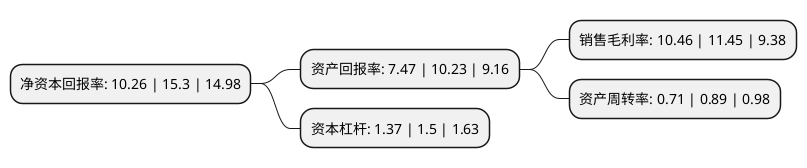

> 本页面由自动化程序生成于 2022年5月20日 01:40
> 内容可能存在错误，如有bug请提交issue至：https://github.com/Eroleice/doc-pi/issues
{.is-warning}

# 上市公司基本情况

## 基本资料

山东齐鲁华信实业股份有限公司（以下简称“齐鲁华信”）成立于2004年03月30日，淄博市。于2021年02月23日在北交所北交所上市。

齐鲁华信注册资本13,876.387万元，应用于石油化工催化，环保催化和煤化工催化的催化剂分子筛的研发，生产和销售，主要包括ZSM-5系列分子筛，Y型系列分子筛，BETA系列分子筛，汽车尾气治理新材料等。以下是详细信息：

- 公司名称: 山东齐鲁华信实业股份有限公司
- 股票代码: 830832.BJ
- 所在地: 山东 - 淄博市
- 成立日期: 2004年03月30日
- 注册资本: 13,876.387万元
- 法定代表人: 李晨光
- 主营业务: 应用于石油化工催化，环保催化和煤化工催化的催化剂分子筛的研发，生产和销售，主要包括ZSM-5系列分子筛，Y型系列分子筛，BETA系列分子筛，汽车尾气治理新材料等
- 公司官网: www.sdqiluhuaxin.com
- 公司介绍: 公司主要从事新型分子筛生产、销售，化工科技服务。公司2009年进入淄博市三十家创新成长型企业之一，先后被评为“淄博市周村区十强企业”“山东省高新技术企业”“山东省诚信企业”“市级守合同重信用企业”称号。公司是“金蜜蜂中国企业社会责任理事会”成员单位，荣获“2010年金蜜蜂企业社会责任·中国榜”上榜企业。公司先后通过ISO9001:2008质量管理体系认证、ISO14001:2004环境管理体系认证、GB/T28001-2001，OHSAS18001:2007职业健康安全管理体系认证等专业体系认证。

## 股东及高管情况

上市公司第一大股东为明曰信，持股12,408,249股，占比8.94%，**疑似为**上市公司实际控制人。

截至2022年03月31日，上市公司的前十大股东中，共有7名自然人股东，3名机构股东，其中5%以上大股东共有1名。上市公司前十大股东明细如下：

> 未能通过持股比例判定出上市公司实际控制人（持股30%以上）
> 可能存在通过间接持股、联合持股、协议控制等方式拥有实际控制权的主体，具体请参考上市公司定期公告！
{.is-warning}

> 上市公司第一大股东持股不超过10%，请检查是否存在公司控制权风险！
{.is-danger}

> 截至2022年03月31日，上市公司前十大股东信息如下：

| 股东名称 | 持股数量（股） | 持股比例 |
| --- | --- | --- |
| 明曰信 | 12,408,249 | 8.94% |
| 山东兴华建设集团园林绿化工程有限公司 | 5,803,200 | 4.18% |
| 马宁 | 3,489,511 | 2.51% |
| 薛熙景 | 3,449,405 | 2.49% |
| 杨晓蕾 | 2,287,042 | 1.65% |
| 淄博新旧动能转换中晟股权投资合伙企业(有限合伙) | 2,000,000 | 1.44% |
| 青岛易租国际贸易有限公司 | 1,722,351 | 1.24% |
| 李晨光 | 1,411,920 | 1.02% |
| 侯普亭 | 1,411,744 | 1.02% |
| 李嘉 | 1,385,152 | 1% |

## 利润表分析

上市公司2021年总收入为5.79亿元，净利润为0.6亿元，实现盈利。

## 杜邦分析

> 数据列示周期：2021年 | 2020年 | 2019年
{.is-info}

上市公司的净资产收益率在近一年有所下降，下降幅度为-32.94%，其变化情况分解如下：
- 上市公司的销售毛利率在近一年下降了-8.65%，可能是生产效率的下降、商品原材料价格上涨或商品价格的下跌所致。
- 上市公司的资产周转率在近一年下降了-20.22%，可能是源自于更慢的销售回款或库存管理效果下降。
- 上市公司的财务杠杆比率在近一年下降了-8.67%，可能是减少负债降低财务费用。

