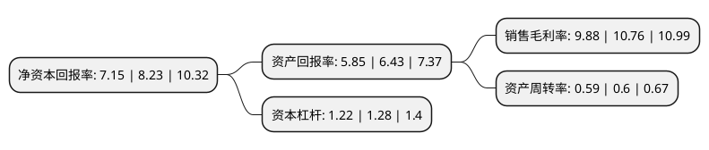

> 本页面由自动化程序生成于 2022年5月20日 01:40
> 内容可能存在错误，如有bug请提交issue至：https://github.com/Eroleice/doc-pi/issues
{.is-warning}

# 上市公司基本情况

## 基本资料

河北润农节水科技股份有限公司（以下简称“润农节水”）成立于2011年06月08日，唐山市。于2020年07月27日在北交所北交所上市。

润农节水注册资本26,120.8万元，节水滴灌管(带)，喷灌设备，过滤，施肥系统，管件，管材的制造和销售;节水灌溉工程的设计，施工安装，技术咨询和服务。以下是详细信息：

- 公司名称: 河北润农节水科技股份有限公司
- 股票代码: 830964.BJ
- 所在地: 河北 - 唐山市
- 成立日期: 2011年06月08日
- 注册资本: 26,120.8万元
- 法定代表人: 张国峰
- 主营业务: 节水滴灌管(带)，喷灌设备，过滤，施肥系统，管件，管材的制造和销售;节水灌溉工程的设计，施工安装，技术咨询和服务
- 公司官网: www.tsrnjs.com
- 公司介绍: 公司专注于节水灌溉行业，致力于节水灌溉材料和设备的研发、制造和销售，以及为节水灌溉项目提供从节水灌溉材料、设备到工程设计、施工、安装、调试、技术支持的一站式服务。公司产品有助于农户合理地利用有限的水资源进行科学灌溉，提高农作物的产量及品质，实现水资源高效利用和农作物科学种植。公司产品主要应用于华北、东北、西北和西南地区，适用的农作物包括小麦、玉米等粮食作物以及棉花、蔬菜、果木等经济作物。

## 股东及高管情况

上市公司第一大股东为薛宝松，持股86,970,163股，占比33.3%，为上市公司实际控制人。

截至2022年03月31日，上市公司的前十大股东中，共有5名自然人股东，3名机构股东，2个产品账户，其中5%以上大股东共有1名。上市公司前十大股东明细如下：

> 截至2022年03月31日，上市公司前十大股东信息如下：

| 股东名称 | 持股数量（股） | 持股比例 |
| --- | --- | --- |
| 薛宝松 | 86,970,163 | 33.3% |
| 北京融拓创新投资管理有限公司-石家庄融拓股权投资基金中心(有限合伙) | 11,500,000 | 4.4% |
| 北京融拓智慧农业投资合伙企业(有限合伙) | 10,500,000 | 4.02% |
| 张国峰 | 8,570,987 | 3.28% |
| 李明欣 | 8,145,631 | 3.12% |
| 北京六合基金管理有限公司-北京市北农果品产业投资中心(有限合伙) | 8,108,000 | 3.1% |
| 水发上善集团有限公司 | 7,717,608 | 2.95% |
| 薛丽霞 | 4,751,318 | 1.82% |
| 薛丽超 | 4,616,018 | 1.77% |
| 唐山汇聚企业管理合伙企业(有限合伙) | 3,958,875 | 1.52% |

## 利润表分析

上市公司2021年总收入为5.89亿元，净利润为0.58亿元，实现盈利。

## 杜邦分析

> 数据列示周期：2021年 | 2020年 | 2019年
{.is-info}

上市公司的净资产收益率在近一年有所下降，下降幅度为-13.12%，其变化情况分解如下：
- 上市公司的销售毛利率在近一年下降了-8.18%，可能是生产效率的下降、商品原材料价格上涨或商品价格的下跌所致。
- 上市公司的资产周转率在近一年下降了-1.67%，可能是源自于更慢的销售回款或库存管理效果下降。
- 上市公司的财务杠杆比率在近一年下降了-4.69%，可能是减少负债降低财务费用。

