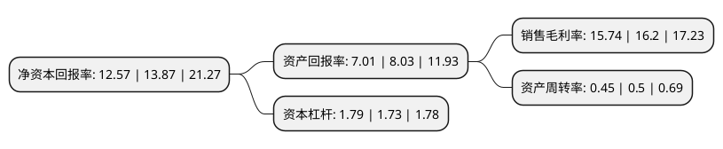

> 本页面由自动化程序生成于 2022年5月20日 01:40
> 内容可能存在错误，如有bug请提交issue至：https://github.com/Eroleice/doc-pi/issues
{.is-warning}

# 上市公司基本情况

## 基本资料

宁夏凯添燃气发展股份有限公司（以下简称“凯添燃气”）成立于2008年09月02日，银川市。于2020年07月27日在北交所北交所上市。

凯添燃气注册资本23,450万元，燃气领域投资，城市燃气的输配及供应，燃气工程安装等以下是详细信息：

- 公司名称: 宁夏凯添燃气发展股份有限公司
- 股票代码: 831010.BJ
- 所在地: 宁夏 - 银川市
- 成立日期: 2008年09月02日
- 注册资本: 23,450万元
- 法定代表人: 龚晓科
- 主营业务: 燃气领域投资，城市燃气的输配及供应，燃气工程安装等
- 公司官网: www.nxgas.com.cn
- 公司介绍: 公司系一家专业从事城镇燃气输配及燃气管道工程安装、燃气装备应用技术研发及运营服务的国家高新技术企业。公司始终致力于天然气全产业链的拓展，在常规天然气输配服务(城市燃气、乡镇燃气、LNG服务)、非常规天然气回收利用服务方面建立了自身的技术和服务优势。公司探索建立＂燃气装备＋燃气服务＂的经营发展模式。旨在突破城市燃气企业的区域限制和发展瓶颈。公司的经营范围为：燃气项目投资、股权投资(不得从事非法集资、吸收公众资金等金融活动)；城市燃气输配及供应；燃气管道和工程安装及维修；燃气器材及器具销售及维修；燃气应用技术、开发及服务；燃气仪表的研发及销售。

## 股东及高管情况

上市公司第一大股东为龚晓科，持股53,380,000股，占比22.76%，**疑似为**上市公司实际控制人。

截至2022年03月31日，上市公司的前十大股东中，共有8名自然人股东，2名机构股东，其中5%以上大股东共有3名。上市公司前十大股东明细如下：

> 未能通过持股比例判定出上市公司实际控制人（持股30%以上）
> 可能存在通过间接持股、联合持股、协议控制等方式拥有实际控制权的主体，具体请参考上市公司定期公告！
{.is-warning}

> 截至2022年03月31日，上市公司前十大股东信息如下：

| 股东名称 | 持股数量（股） | 持股比例 |
| --- | --- | --- |
| 龚晓科 | 53,380,000 | 22.76% |
| 凯添能源装备有限公司 | 45,015,500 | 19.2% |
| 穆云飞 | 26,988,196 | 11.51% |
| 王中琴 | 10,951,300 | 4.67% |
| 穆晓郎 | 6,755,300 | 2.88% |
| 杨延飞 | 3,412,020 | 1.46% |
| 尹湘 | 3,400,000 | 1.45% |
| 元锦珍 | 2,950,239 | 1.26% |
| 兰溪分众恒盈投资合伙企业(有限合伙) | 2,743,709 | 1.17% |
| 李頲 | 2,429,380 | 1.03% |

## 利润表分析

上市公司2021年总收入为4.59亿元，净利润为0.72亿元，实现盈利。

## 杜邦分析

> 数据列示周期：2021年 | 2020年 | 2019年
{.is-info}

上市公司的净资产收益率在近一年有所下降，下降幅度为-9.37%，其变化情况分解如下：
- 上市公司的销售毛利率在近一年下降了-2.84%，可能是生产效率的下降、商品原材料价格上涨或商品价格的下跌所致。
- 上市公司的资产周转率在近一年下降了-10%，可能是源自于更慢的销售回款或库存管理效果下降。
- 上市公司的财务杠杆比率在近一年上升了3.47%，可能是增加负债扩大生产规模。

