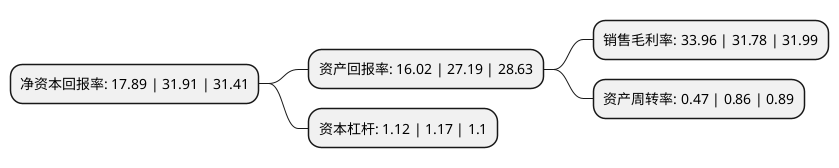

> 本页面由自动化程序生成于 2022年5月20日 01:40
> 内容可能存在错误，如有bug请提交issue至：https://github.com/Eroleice/doc-pi/issues
{.is-warning}

# 上市公司基本情况

## 基本资料

上海海希工业通讯股份有限公司（以下简称“海希通讯”）成立于2001年06月29日，上海市。于2021年11月05日在北交所北交所上市。

海希通讯注册资本7,013万元，工业无线遥控设备的研发，制造，销售及进口工业无线遥控设备二次开发，组装，销售及技术服务以下是详细信息：

- 公司名称: 上海海希工业通讯股份有限公司
- 股票代码: 831305.BJ
- 所在地: 上海 - 上海市
- 成立日期: 2001年06月29日
- 注册资本: 7,013万元
- 法定代表人: LI TONG
- 主营业务: 工业无线遥控设备的研发，制造，销售及进口工业无线遥控设备二次开发，组装，销售及技术服务
- 公司官网: www.hysea.com.cn
- 公司介绍: 公司是国内工业无线控制行业的领先企业，专注于工业无线遥控系统及工程机械电气控制系统解决方案的研发、集成、生产及售后服务。公司在起重机械、工程机械、建筑机械、特种机械等移动机械领域电气配套系统具有领导地位，并在冶金、汽车制造、造纸、船舶、核电等行业享有良好的声誉。

## 股东及高管情况

上市公司第一大股东为周彤，持股40,580,000股，占比57.864%，为上市公司实际控制人。

截至2022年03月31日，上市公司的前十大股东中，共有7名自然人股东，2名机构股东，1个产品账户，其中5%以上大股东共有1名。上市公司前十大股东明细如下：

> 截至2022年03月31日，上市公司前十大股东信息如下：

| 股东名称 | 持股数量（股） | 持股比例 |
| --- | --- | --- |
| 周彤 | 40,580,000 | 57.864% |
| 李竞 | 2,694,500 | 3.842% |
| 周丹 | 2,629,000 | 3.749% |
| 姚进 | 2,540,000 | 3.622% |
| 上海证大资产管理有限公司-证大创富3号私募证券投资基金 | 1,280,000 | 1.825% |
| 江海证券有限公司 | 564,200 | 0.805% |
| 蔡丹 | 513,500 | 0.732% |
| 齐方 | 500,000 | 0.713% |
| 晨鸣(青岛)资产管理有限公司-青岛晨融柒号股权投资管理中心(有限合伙) | 470,000 | 0.67% |
| 李迎 | 340,000 | 0.485% |

## 利润表分析

上市公司2021年总收入为2.85亿元，净利润为0.97亿元，实现盈利。

## 杜邦分析

> 数据列示周期：2021年 | 2020年 | 2019年
{.is-info}

上市公司的净资产收益率在近一年有所下降，下降幅度为-43.94%，其变化情况分解如下：
- 上市公司的销售毛利率在近一年上升了6.86%，可能是生产效率的提升、商品原材料价格下跌或商品价格的上涨所致。
- 上市公司的资产周转率在近一年下降了-45.35%，可能是源自于更慢的销售回款或库存管理效果下降。
- 上市公司的财务杠杆比率在近一年下降了-4.27%，可能是减少负债降低财务费用。

