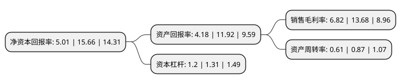

> 本页面由自动化程序生成于 2022年5月20日 01:40
> 内容可能存在错误，如有bug请提交issue至：https://github.com/Eroleice/doc-pi/issues
{.is-warning}

# 上市公司基本情况

## 基本资料

新安洁环境卫生股份有限公司（以下简称“新安洁”）成立于2011年07月15日，重庆市。于2020年07月27日在北交所北交所上市。

新安洁注册资本30,628万元，城乡道路及社区生活垃圾清扫保洁，收集;生活垃圾分类，生活垃圾(含餐厨垃圾)经营性运输，处置;城市园林绿化管护，施工;物业管理;清洁服务;公厕管理;水域清漂;疏浚清掏;绿色植物种植和销售等。以下是详细信息：

- 公司名称: 新安洁环境卫生股份有限公司
- 股票代码: 831370.BJ
- 所在地: 重庆 - 重庆市
- 成立日期: 2011年07月15日
- 注册资本: 30,628万元
- 法定代表人: 魏延田
- 主营业务: 城乡道路及社区生活垃圾清扫保洁，收集;生活垃圾分类，生活垃圾(含餐厨垃圾)经营性运输，处置;城市园林绿化管护，施工;物业管理;清洁服务;公厕管理;水域清漂;疏浚清掏;绿色植物种植和销售等
- 公司官网: www.cqange.com
- 公司介绍: 公司致力于建设美好人居环境，是一家专业的城乡环境综合服务商。公司以满足人民日益提升的人居环境要求为宗旨，不断拓展服务体系，提升主动管理能力，逐步形成了以环卫服务为基础，以垃圾分类收运及处置、绿化工程服务等服务为延伸的综合服务体系。当前，在国家不断深化改革的背景下，政府提出公共服务市场化改革，加大在公共服务领域政府购买公共服务项目的力度。未来，公司将继续以建设美好人居环境为奋斗目标，在农村环境整治、城市垃圾分类收运等社会需求强烈的领域提供综合解决方案。

## 股东及高管情况

上市公司第一大股东为暄洁控股股份有限公司，持股147,422,200股，占比48.1331%，为上市公司实际控制人。

截至2022年03月31日，上市公司的前十大股东中，共有3名自然人股东，4名机构股东，3个产品账户，其中5%以上大股东共有1名。上市公司前十大股东明细如下：

> 截至2022年03月31日，上市公司前十大股东信息如下：

| 股东名称 | 持股数量（股） | 持股比例 |
| --- | --- | --- |
| 暄洁控股股份有限公司 | 147,422,200 | 48.1331% |
| 重庆盟发企业管理咨询中心(有限合伙) | 12,023,433 | 3.9256% |
| 中国工商银行股份有限公司-汇添富创新增长一年定期开放混合型证券投资基金 | 8,852,284 | 2.8903% |
| 中国工商银行股份有限公司 | 8,852,284 | 2.8903% |
| 魏文筠 | 7,362,800 | 2.4039% |
| 重庆和信汇智工业产业股权投资基金合伙企业(有限合伙) | 6,226,000 | 2.0328% |
| 唐建柏 | 3,530,000 | 1.1525% |
| 北京瀚华露笑投资合伙企业(有限合伙) | 3,001,823 | 0.9801% |
| 尹以桥 | 2,250,000 | 0.7346% |
| 广州前润一号转板股权投资基金合伙企业(有限合伙) | 2,045,238 | 0.6678% |

## 利润表分析

上市公司2021年总收入为6.11亿元，净利润为0.41亿元，实现盈利。

## 杜邦分析

> 数据列示周期：2021年 | 2020年 | 2019年
{.is-info}

上市公司的净资产收益率在近一年有所下降，下降幅度为-68.01%，其变化情况分解如下：
- 上市公司的销售毛利率在近一年下降了-50.15%，可能是生产效率的下降、商品原材料价格上涨或商品价格的下跌所致。
- 上市公司的资产周转率在近一年下降了-29.89%，可能是源自于更慢的销售回款或库存管理效果下降。
- 上市公司的财务杠杆比率在近一年下降了-8.4%，可能是减少负债降低财务费用。

