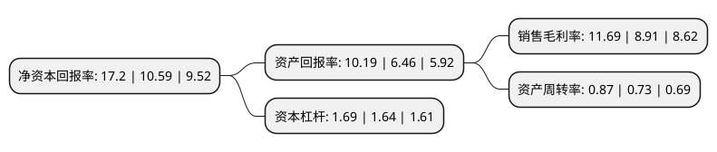

> 本页面由自动化程序生成于 2022年5月20日 01:40
> 内容可能存在错误，如有bug请提交issue至：https://github.com/Eroleice/doc-pi/issues
{.is-warning}

# 上市公司基本情况

## 基本资料

威海克莱特菲尔风机股份有限公司（以下简称“克莱特”）成立于2001年09月19日，威海市。于2022年03月21日在北交所北交所上市。

克莱特注册资本7,340万元，轨道交通风机，能源通风冷却设备，冷却塔和空冷器风扇，海洋工程装备和高技术船舶风机，制冷风机，冷却单元等通风与空气处理系统装备及其配件的设计研发，生产，销售，及相关产品的检修和服务。以下是详细信息：

- 公司名称: 威海克莱特菲尔风机股份有限公司
- 股票代码: 831689.BJ
- 所在地: 山东 - 威海市
- 成立日期: 2001年09月19日
- 注册资本: 7,340万元
- 法定代表人: 盛军岭
- 主营业务: 轨道交通风机，能源通风冷却设备，冷却塔和空冷器风扇，海洋工程装备和高技术船舶风机，制冷风机，冷却单元等通风与空气处理系统装备及其配件的设计研发，生产，销售，及相关产品的检修和服务
- 公司官网: www.creditfan.com.cn
- 公司介绍: 公司主要生产轴流、离心、斜流三大系列上百个品种的通风机，产品涵盖轨道交通风机、冷冻空调用风机、轨道交通风机、船用风机、核电用风机、屋顶风机、冷却塔用风机、海上钻井平台用风机等，产品获得过山东省名牌产品、山东省著名商标等荣誉称号。公司是铁道部认定的和谐号机车用、动车用以及高铁用风机供应商，是铁道行业2项部颁标准编写单位，是风机行业首家通过IRIS体系、AAR体系国际标准认证及CRCC认证的企业，也是中国风机行业首家通过GE风机产品设计认证的企业。目前公司的主要客户除了GE、阿尔斯通、西门子、庞巴迪、阿特拉斯、斯必克、卡特彼勒、BAC、基伊埃等全球知名五百强企业之外，还包括中石油、中国南车、中国北车、首都钢铁、中船重工等国内知名企业。

## 股东及高管情况

上市公司第一大股东为威海克莱特集团有限公司，持股33,280,139股，占比45.34%，为上市公司实际控制人。

截至2022年05月12日，上市公司的前十大股东中，共有1名自然人股东，6名机构股东，3个产品账户，其中5%以上大股东共有5名。上市公司前十大股东明细如下：

> 截至2022年05月12日，上市公司前十大股东信息如下：

| 股东名称 | 持股数量（股） | 持股比例 |
| --- | --- | --- |
| 威海克莱特集团有限公司 | 33,280,139 | 45.34% |
| 威海克莱特集团有限公司 | 32,936,000 | 44.87% |
| 核建产业基金管理有限公司-融核产业发展基金(海盐)合伙企业(有限合伙) | 7,690,000 | 10.48% |
| 深圳市中广核汇联二号新能源股权投资合伙企业(有限合伙) | 5,150,000 | 7.01% |
| 深圳市中广核汇联二号新能源股权投资合伙企业(有限合伙) | 5,150,000 | 7.01% |
| 中车资本(天津)股权投资基金管理有限公司-华舆正心(天津)股权投资基金合伙企业(有限合伙) | 2,822,000 | 3.84% |
| 红塔创新投资股份有限公司 | 2,219,000 | 3.02% |
| 青岛东润创业投资中心(有限合伙) | 2,170,363 | 2.96% |
| 西南证券股份有限公司行使超额配售选择权专用证券账户 | 1,500,000 | 2.04% |
| 王新 | 817,200 | 1.11% |

## 利润表分析

上市公司2021年总收入为3.91亿元，净利润为0.45亿元，实现盈利。

## 杜邦分析

> 数据列示周期：2021年 | 2020年 | 2019年
{.is-info}

上市公司的净资产收益率在近一年有所上升，上升幅度为62.42%，其变化情况分解如下：
- 上市公司的销售毛利率在近一年上升了31.2%，可能是生产效率的提升、商品原材料价格下跌或商品价格的上涨所致。
- 上市公司的资产周转率在近一年上升了19.18%，可能是源自于更快的销售回款或库存管理效果提升。
- 上市公司的财务杠杆比率在近一年上升了3.05%，可能是增加负债扩大生产规模。

