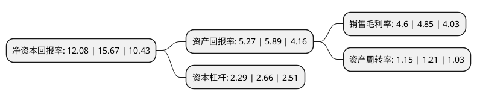

> 本页面由自动化程序生成于 2022年5月20日 01:40
> 内容可能存在错误，如有bug请提交issue至：https://github.com/Eroleice/doc-pi/issues
{.is-warning}

# 上市公司基本情况

## 基本资料

珠海拾比佰彩图板股份有限公司（以下简称“拾比佰”）成立于1995年12月20日，珠海市。于2021年06月28日在北交所北交所上市。

拾比佰注册资本11,097万元，金属外观复合材料，主要包括覆膜板(VCM)，预涂板(PCM)，轻量化金属复合板(MCM)以下是详细信息：

- 公司名称: 珠海拾比佰彩图板股份有限公司
- 股票代码: 831768.BJ
- 所在地: 广东 - 珠海市
- 成立日期: 1995年12月20日
- 注册资本: 11,097万元
- 法定代表人: 杜国栋
- 主营业务: 金属外观复合材料，主要包括覆膜板(VCM)，预涂板(PCM)，轻量化金属复合板(MCM)
- 公司官网: www.zhspb.com
- 公司介绍: 公司拥有覆膜板、预涂板、拉丝板及压花板四大产品种类，共20多个系列，1000多个花色品种的产品，已成为国内品种最为齐全，种类最为丰富的专业生产厂家，依托雄厚的技术基础以及优越的设备条件，凭借敏锐的市场嗅觉、超前的开发意识以及高效的开发速度，拾比佰将继续引领行业的发展风向及高度；是国内最早规模生产金属外观复合材料的中外合资生产企业；国内最大的金属外观复合材料生产厂家之一，加工能力达10万吨/年；国内最早拥有计算机全数字自动控制的覆膜、预涂板生产线的金属外观复合材料生产企业；率先在行业内推行ISO质量和环境管理体系，并荣获“高新技术企业”称号；多项技术及产品领先同行；不断创新，已成为拾比佰持续发展的原动力。

## 股东及高管情况

上市公司第一大股东为珠海市拾比伯投资管理有限公司，持股28,860,000股，占比26.01%，**疑似为**上市公司实际控制人。

截至2022年03月31日，上市公司的前十大股东中，共有2名自然人股东，7名机构股东，1个产品账户，其中5%以上大股东共有3名。上市公司前十大股东明细如下：

> 未能通过持股比例判定出上市公司实际控制人（持股30%以上）
> 可能存在通过间接持股、联合持股、协议控制等方式拥有实际控制权的主体，具体请参考上市公司定期公告！
{.is-warning}

> 截至2022年03月31日，上市公司前十大股东信息如下：

| 股东名称 | 持股数量（股） | 持股比例 |
| --- | --- | --- |
| 珠海市拾比伯投资管理有限公司 | 28,860,000 | 26.01% |
| 拾比佰(澳门)有限公司 | 14,240,000 | 12.83% |
| 广东省科技创业投资有限公司 | 10,800,000 | 9.73% |
| 诸暨弘信晨晟创业投资中心(有限合伙) | 4,292,857 | 3.87% |
| 珠海市共富贸易有限公司 | 3,600,000 | 3.24% |
| 平潭汇垠四号股权投资合伙企业(有限合伙) | 2,796,543 | 2.52% |
| 佛山骏驰云捷企业管理合伙企业(有限合伙) | 2,788,730 | 2.51% |
| 吴仕祥 | 1,118,888 | 1.01% |
| 西安敦成投资管理有限公司-陕西兴航成投资基金合伙企业(有限合伙) | 930,387 | 0.84% |
| 黄炳鸿 | 809,000 | 0.73% |

## 利润表分析

上市公司2021年总收入为14.15亿元，净利润为0.65亿元，实现盈利。

## 杜邦分析

> 数据列示周期：2021年 | 2020年 | 2019年
{.is-info}

上市公司的净资产收益率在近一年有所下降，下降幅度为-22.91%，其变化情况分解如下：
- 上市公司的销售毛利率在近一年下降了-5.15%，可能是生产效率的下降、商品原材料价格上涨或商品价格的下跌所致。
- 上市公司的资产周转率在近一年下降了-4.96%，可能是源自于更慢的销售回款或库存管理效果下降。
- 上市公司的财务杠杆比率在近一年下降了-13.91%，可能是减少负债降低财务费用。

