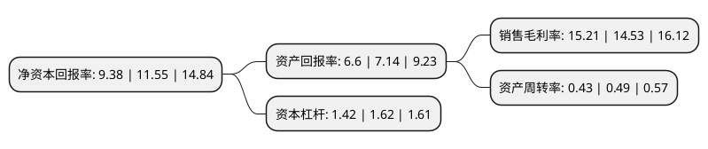

> 本页面由自动化程序生成于 2022年5月20日 01:40
> 内容可能存在错误，如有bug请提交issue至：https://github.com/Eroleice/doc-pi/issues
{.is-warning}

# 上市公司基本情况

## 基本资料

山西科达自控股份有限公司（以下简称“科达自控”）成立于2000年11月20日，太原市。于2021年11月15日在北交所北交所上市。

科达自控注册资本7,278万元，是应用工业互联网技术体系，向客户提供矿山数据监测与自动控制系统，市政数据远程监测系统，自动控制相关产品和365在现(线)自动化技术服务，解决客户对于生产过程中的智能化改造和自动化控制的需求，主要应用领域为矿山，市政等领域。以下是详细信息：

- 公司名称: 山西科达自控股份有限公司
- 股票代码: 831832.BJ
- 所在地: 山西 - 太原市
- 成立日期: 2000年11月20日
- 注册资本: 7,278万元
- 法定代表人: 付国军
- 主营业务: 是应用工业互联网技术体系，向客户提供矿山数据监测与自动控制系统，市政数据远程监测系统，自动控制相关产品和365在现(线)自动化技术服务，解决客户对于生产过程中的智能化改造和自动化控制的需求，主要应用领域为矿山，市政等领域
- 公司官网: www.sxkeda.com
- 公司介绍: 公司是一家提供煤矿自动化系统整体解决方案、煤矿大型关键设备自动化节能控制装置及煤矿自动化“物业式”专业服务的高新技术企业,主要服务行业有：煤矿自动化和城市公共设施自动化(市政自动化)。公司先后取得了9000体系认证、3C认证、煤安标志认证、工程施工等资质10多个，连续六年被评为高新区模范企业，近三年先后被评为山西省优秀民营科技企业，山西省民营科技创新型企业。被认定为山西省第一批高新技术企业、山西省省级技术中心。自主研发的产品先后多次获省市科技进步奖，取得多项国家专利，多项产品列入国家火炬计划项目。

## 股东及高管情况

上市公司第一大股东为付国军，持股14,184,911股，占比19.4901%，**疑似为**上市公司实际控制人。

截至2022年03月31日，上市公司的前十大股东中，共有4名自然人股东，6名机构股东，其中5%以上大股东共有2名。上市公司前十大股东明细如下：

> 未能通过持股比例判定出上市公司实际控制人（持股30%以上）
> 可能存在通过间接持股、联合持股、协议控制等方式拥有实际控制权的主体，具体请参考上市公司定期公告！
{.is-warning}

> 截至2022年03月31日，上市公司前十大股东信息如下：

| 股东名称 | 持股数量（股） | 持股比例 |
| --- | --- | --- |
| 付国军 | 14,184,911 | 19.4901% |
| 李惠勇 | 9,792,367 | 13.4547% |
| 山西转型综改示范区汇峰合盛股权投资合伙企业(有限合伙) | 3,638,900 | 4.9999% |
| 山西红土创新创业投资有限公司 | 3,257,718 | 4.4761% |
| 太原联盈科创投资部(普通合伙) | 2,667,225 | 3.6648% |
| 浙江容亿投资管理有限公司-浙江容腾创业投资合伙企业(有限合伙) | 2,253,750 | 3.0967% |
| 深圳市创新投资集团有限公司 | 1,628,860 | 2.2381% |
| 北京金瑞兴业投资管理中心(有限合伙) | 1,500,000 | 2.061% |
| 陈浩 | 1,270,976 | 1.7463% |
| 苏士建 | 1,201,965 | 1.6515% |

## 利润表分析

上市公司2021年总收入为2.63亿元，净利润为0.4亿元，实现盈利。

## 杜邦分析

> 数据列示周期：2021年 | 2020年 | 2019年
{.is-info}

上市公司的净资产收益率在近一年有所下降，下降幅度为-18.79%，其变化情况分解如下：
- 上市公司的销售毛利率在近一年上升了4.68%，可能是生产效率的提升、商品原材料价格下跌或商品价格的上涨所致。
- 上市公司的资产周转率在近一年下降了-12.24%，可能是源自于更慢的销售回款或库存管理效果下降。
- 上市公司的财务杠杆比率在近一年下降了-12.35%，可能是减少负债降低财务费用。

