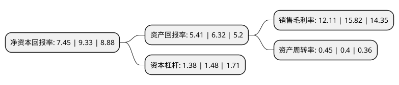

> 本页面由自动化程序生成于 2022年5月20日 01:40
> 内容可能存在错误，如有bug请提交issue至：https://github.com/Eroleice/doc-pi/issues
{.is-warning}

# 上市公司基本情况

## 基本资料

上海创远仪器技术股份有限公司（以下简称“创远仪器”）成立于2005年08月09日，上海市。于2020年07月27日在北交所北交所上市。

创远仪器注册资本10,991.536万元，公司主要产品包括信号模拟与信号发生系列，信号分析与频谱分析系列，矢量网络分析系列，无线网络测试与信道模拟系列，无线电监测与北斗导航测试等系列测试仪器与解决方案。以下是详细信息：

- 公司名称: 上海创远仪器技术股份有限公司
- 股票代码: 831961.BJ
- 所在地: 上海 - 上海市
- 成立日期: 2005年08月09日
- 注册资本: 10,991.536万元
- 法定代表人: 冯跃军
- 主营业务: 公司主要产品包括信号模拟与信号发生系列，信号分析与频谱分析系列，矢量网络分析系列，无线网络测试与信道模拟系列，无线电监测与北斗导航测试等系列测试仪器与解决方案
- 公司官网: www.transcom.net.cn
- 公司介绍: 公司专注于研发无线通信与射频微波测试仪器。经过多年的发展，公司重点拓展无线通信市场、无线电监测和北斗导航市场、以无线通信为主的智能制造市场三个方向，拥有了自主品牌和一系列测试仪器核心专利技术。在无线通信和射频微波测试领域，公司经过多年发展形成了较强的自主研发能力，并通过持续的研发投入及参与国家科技重大专项研发课题，积累了较强的技术优势。公司拥有多项发明专利、实用新型专利、外观设计专利.公司从2012年起先后牵头承担了国家“新一代宽带无线移动通信网”科技重大专项课题开发任务、上海市软件和集成电路产业发展专项、新一代信息基础设施建设信息化发展专项、上海市产业转型升级发展专项(工业强基)、战略性新兴产业发展专项、科技创新行动等科研任务，还承担了上海无线通信测试仪器工程技术研究中心的持续建设任务。2016年12月，公司获得“国家科学技术进步奖”特等奖。公司作为IMT-2020(5G)推进组成员，全面开展5G通信测试技术的研究，推出了5G信号源、5G信号分析仪、5G扫频仪、5G信道模拟器等一系列面向5G的产品及测试解决方案，核心竞争力不断提升。

## 股东及高管情况

上市公司第一大股东为上海创远电子设备有限公司，持股29,817,410股，占比27.1276%，**疑似为**上市公司实际控制人。

截至2022年04月01日，上市公司的前十大股东中，共有5名自然人股东，4名机构股东，1个产品账户，其中5%以上大股东共有2名。上市公司前十大股东明细如下：

> 未能通过持股比例判定出上市公司实际控制人（持股30%以上）
> 可能存在通过间接持股、联合持股、协议控制等方式拥有实际控制权的主体，具体请参考上市公司定期公告！
{.is-warning}

> 截至2022年04月01日，上市公司前十大股东信息如下：

| 股东名称 | 持股数量（股） | 持股比例 |
| --- | --- | --- |
| 上海创远电子设备有限公司 | 29,817,410 | 27.1276% |
| 陈忆元 | 6,857,972 | 6.2393% |
| 吉红霞 | 5,473,260 | 4.9795% |
| 上海东苑房地产开发(集团)有限公司 | 3,639,239 | 3.3109% |
| 上海上创新微投资管理有限公司-上海物联网二期创业投资基金合伙企业(有限合伙) | 2,870,220 | 2.6113% |
| 冯跃军 | 2,281,500 | 2.0757% |
| 诸暨卓众股权投资合伙企业(有限合伙) | 2,232,100 | 2.0307% |
| 孟华 | 2,222,792 | 2.0223% |
| 杨孝全 | 2,037,463 | 1.8537% |
| 上海东方证券创新投资有限公司 | 2,023,865 | 1.8413% |

## 利润表分析

上市公司2021年总收入为4.21亿元，净利润为0.51亿元，实现盈利。

## 杜邦分析

> 数据列示周期：2021年 | 2020年 | 2019年
{.is-info}

上市公司的净资产收益率在近一年有所下降，下降幅度为-20.15%，其变化情况分解如下：
- 上市公司的销售毛利率在近一年下降了-23.45%，可能是生产效率的下降、商品原材料价格上涨或商品价格的下跌所致。
- 上市公司的资产周转率在近一年上升了12.5%，可能是源自于更快的销售回款或库存管理效果提升。
- 上市公司的财务杠杆比率在近一年下降了-6.76%，可能是减少负债降低财务费用。

