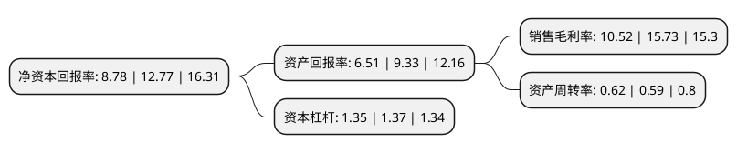

> 本页面由自动化程序生成于 2022年5月20日 01:40
> 内容可能存在错误，如有bug请提交issue至：https://github.com/Eroleice/doc-pi/issues
{.is-warning}

# 上市公司基本情况

## 基本资料

安徽凤凰滤清器股份有限公司（以下简称“安徽凤凰”）成立于2006年12月19日，蚌埠市。于2020年12月23日在北交所北交所上市。

安徽凤凰注册资本9,636.907万元，汽车滤清器及过滤材料的研发，生产和销售以下是详细信息：

- 公司名称: 安徽凤凰滤清器股份有限公司
- 股票代码: 832000.BJ
- 所在地: 安徽 - 蚌埠市
- 成立日期: 2006年12月19日
- 注册资本: 9,636.907万元
- 法定代表人: 巫界树
- 主营业务: 汽车滤清器及过滤材料的研发，生产和销售
- 公司官网: www.phoenixfilters.net
- 公司介绍: 公司主要从事汽车滤清器的研发、生产和销售，公司产品主要为汽车滤清器，包括空气滤清器、空调滤清器、机油滤清器和燃油滤清器四大系列，共6,000多个品种，广泛应用于乘用车、商用车售后服务市场。公司产品“环保型旋装式机油滤清器”被认定为安徽省2013年度重点新产品和安徽省高新技术产品。2011年公司被慧聪汽车配件网授予“十佳滤清器民族品牌”称号,2012年度、2013年度公司被慧聪汽车配件网授予“十佳滤清器知名品牌”称号，2014年度公司被中国汽车配件用品行业总评榜组织委员会授予“中国汽车用品行业十大驰名品牌”称号。

## 股东及高管情况

上市公司第一大股东为巫界树，持股43,815,600股，占比45.4665%，为上市公司实际控制人。

截至2022年03月31日，上市公司的前十大股东中，共有5名自然人股东，4名机构股东，1个产品账户，其中5%以上大股东共有3名。上市公司前十大股东明细如下：

> 截至2022年03月31日，上市公司前十大股东信息如下：

| 股东名称 | 持股数量（股） | 持股比例 |
| --- | --- | --- |
| 巫界树 | 43,815,600 | 45.4665% |
| 蚌埠市菲尼斯过滤技术有限公司 | 10,800,000 | 11.2069% |
| 蚌埠高新投资集团有限公司 | 6,420,000 | 6.6619% |
| 国元证券股份有限公司 | 3,544,834 | 3.6784% |
| 合肥信联股权投资合伙企业(有限合伙) | 1,039,079 | 1.0782% |
| 陈登宇 | 998,400 | 1.036% |
| 蚌埠天使投资基金(有限合伙) | 960,000 | 0.9962% |
| 张燕 | 777,600 | 0.8069% |
| 陈元姣 | 660,000 | 0.6849% |
| 孙峰 | 660,000 | 0.6849% |

## 利润表分析

上市公司2021年总收入为3.89亿元，净利润为0.4亿元，实现盈利。

## 杜邦分析

> 数据列示周期：2021年 | 2020年 | 2019年
{.is-info}

上市公司的净资产收益率在近一年有所下降，下降幅度为-31.25%，其变化情况分解如下：
- 上市公司的销售毛利率在近一年下降了-33.12%，可能是生产效率的下降、商品原材料价格上涨或商品价格的下跌所致。
- 上市公司的资产周转率在近一年上升了5.08%，可能是源自于更快的销售回款或库存管理效果提升。
- 上市公司的财务杠杆比率在近一年下降了-1.46%，可能是减少负债降低财务费用。

