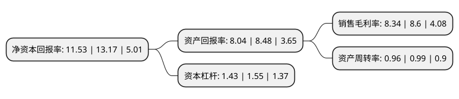

> 本页面由自动化程序生成于 2022年5月20日 01:40
> 内容可能存在错误，如有bug请提交issue至：https://github.com/Eroleice/doc-pi/issues
{.is-warning}

# 上市公司基本情况

## 基本资料

苏州禾昌聚合材料股份有限公司（以下简称“禾昌聚合”）成立于1999年06月09日，苏州市。于2021年11月09日在北交所北交所上市。

禾昌聚合注册资本10,762万元，改性塑料的研发，生产，销售以下是详细信息：

- 公司名称: 苏州禾昌聚合材料股份有限公司
- 股票代码: 832089.BJ
- 所在地: 江苏 - 苏州市
- 成立日期: 1999年06月09日
- 注册资本: 10,762万元
- 法定代表人: 赵东明
- 主营业务: 改性塑料的研发，生产，销售
- 公司官网: www.szhc.com
- 公司介绍: 公司一直致力于通过技术进步拓宽改性塑料产品在工业中的应用,现在公司已发展成产品应用领域以汽车零部件为主，同时涵盖家电、通信、电动工具、电气、交通运输等领域的规模性企业，并获得国内多个知名厂商的认证，成为国内改性塑料行业最具研发实力和规模生产力的专业服务商之一。公司目前拥有4项发明专利、10项实用新型专利，并先后承担和完成了多项国家火炬计划项目，还先后被认定为“苏州汽车零部件产业基地”、“江苏省工程技术研究中心”、“江苏省长玻纤增强改性塑料工程技术中心”，是获得江苏省科学技术厅、江苏省财政厅、江苏省国家税务局、江苏省地方税务局共同认可的高新技术企业。

## 股东及高管情况

上市公司第一大股东为赵东明，持股42,143,334股，占比39.16%，为上市公司实际控制人。

截至2022年03月31日，上市公司的前十大股东中，共有7名自然人股东，3名机构股东，其中5%以上大股东共有2名。上市公司前十大股东明细如下：

> 截至2022年03月31日，上市公司前十大股东信息如下：

| 股东名称 | 持股数量（股） | 持股比例 |
| --- | --- | --- |
| 赵东明 | 42,143,334 | 39.16% |
| 蒋学元 | 10,648,016 | 9.89% |
| 曾超 | 3,536,250 | 3.29% |
| 包建华 | 3,400,000 | 3.16% |
| 朱国英 | 2,350,150 | 2.18% |
| 朱国钧 | 2,000,000 | 1.86% |
| 江海证券有限公司 | 1,500,000 | 1.39% |
| 苏州华成创东方创业投资企业(有限合伙) | 1,400,000 | 1.3% |
| 天风证券股份有限公司 | 1,200,000 | 1.12% |
| 王蔚 | 1,036,000 | 0.96% |

## 利润表分析

上市公司2021年总收入为9.76亿元，净利润为0.81亿元，实现盈利。

## 杜邦分析

> 数据列示周期：2021年 | 2020年 | 2019年
{.is-info}

上市公司的净资产收益率在近一年有所下降，下降幅度为-12.45%，其变化情况分解如下：
- 上市公司的销售毛利率在近一年下降了-3.02%，可能是生产效率的下降、商品原材料价格上涨或商品价格的下跌所致。
- 上市公司的资产周转率在近一年下降了-3.03%，可能是源自于更慢的销售回款或库存管理效果下降。
- 上市公司的财务杠杆比率在近一年下降了-7.74%，可能是减少负债降低财务费用。

