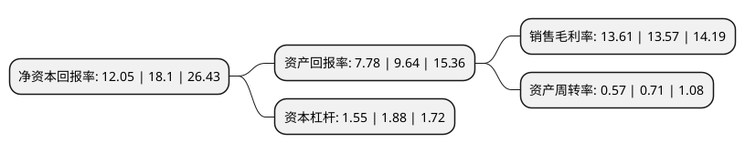

> 本页面由自动化程序生成于 2022年5月20日 01:40
> 内容可能存在错误，如有bug请提交issue至：https://github.com/Eroleice/doc-pi/issues
{.is-warning}

# 上市公司基本情况

## 基本资料

河北志晟信息技术股份有限公司（以下简称“志晟信息”）成立于2004年03月15日，廊坊市。于2021年11月15日在北交所北交所上市。

志晟信息注册资本6,682.216万元，智慧城市业务，运维及服务，硬件销售以下是详细信息：

- 公司名称: 河北志晟信息技术股份有限公司
- 股票代码: 832171.BJ
- 所在地: 河北 - 廊坊市
- 成立日期: 2004年03月15日
- 注册资本: 6,682.216万元
- 法定代表人: 穆志刚
- 主营业务: 智慧城市业务，运维及服务，硬件销售
- 公司官网: www.zccninfo.com
- 公司介绍: 公司是一家主要提供系统集成服务的一体化IT服务企业。客户群体较为分散，分布在政府、教育以及其他各类企事业单位。服务的内容为基础咨询、技术支持、IT产品销售、系统集成、IT服务租赁以及售后服务。目前，公司已发展成为廊坊市优秀的一体化IT服务商之一，在系统集成领域具备良好的口碑，是当地代表性企业；是拥有自主产品、通过相关资质认证、业务链完整的企业之一。

## 股东及高管情况

上市公司第一大股东为穆志刚，持股28,171,557股，占比42.16%，为上市公司实际控制人。

截至2022年05月06日，上市公司的前十大股东中，共有6名自然人股东，1名机构股东，3个产品账户，其中5%以上大股东共有5名。上市公司前十大股东明细如下：

> 截至2022年05月06日，上市公司前十大股东信息如下：

| 股东名称 | 持股数量（股） | 持股比例 |
| --- | --- | --- |
| 穆志刚 | 28,171,557 | 42.16% |
| 穆志刚 | 28,171,557 | 42.16% |
| 阎梅 | 10,456,600 | 15.65% |
| 廊坊冀财新毅创业引导股权投资基金(有限合伙) | 4,999,000 | 7.48% |
| 廊坊冀财新毅创业引导股权投资基金(有限合伙) | 4,999,000 | 7.48% |
| 廊坊市云智文化传媒合伙企业(有限合伙) | 1,046,400 | 1.57% |
| 晨鸣(青岛)资产管理有限公司-晨鸣资管青岛三板精选陆号股权投资私募基金 | 1,000,000 | 1.5% |
| 黄龙江 | 525,000 | 0.79% |
| 阳伟鹏 | 400,000 | 0.6% |
| 张敏 | 381,000 | 0.57% |

## 利润表分析

上市公司2021年总收入为2.8亿元，净利润为0.38亿元，实现盈利。

## 杜邦分析

> 数据列示周期：2021年 | 2020年 | 2019年
{.is-info}

上市公司的净资产收益率在近一年有所下降，下降幅度为-33.43%，其变化情况分解如下：
- 上市公司的销售毛利率在近一年上升了0.29%，可能是生产效率的提升、商品原材料价格下跌或商品价格的上涨所致。
- 上市公司的资产周转率在近一年下降了-19.72%，可能是源自于更慢的销售回款或库存管理效果下降。
- 上市公司的财务杠杆比率在近一年下降了-17.55%，可能是减少负债降低财务费用。

