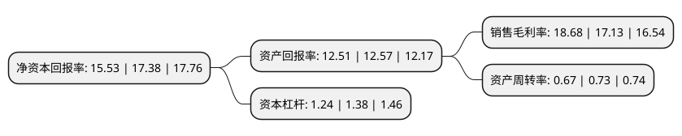

> 本页面由自动化程序生成于 2022年5月20日 01:40
> 内容可能存在错误，如有bug请提交issue至：https://github.com/Eroleice/doc-pi/issues
{.is-warning}

# 上市公司基本情况

## 基本资料

四川梓橦宫药业股份有限公司（以下简称“梓橦宫”）成立于2005年04月26日，内江市。于2021年08月13日在北交所北交所上市。

梓橦宫注册资本7,328.054万元，生产，销售:片剂，硬胶囊剂，搽剂，散剂，软膏剂，中药饮片，口服混悬剂;开发，研制药品;种植，销售，收购:中药材(不含甘草，麻黄草)。以下是详细信息：

- 公司名称: 四川梓橦宫药业股份有限公司
- 股票代码: 832566.BJ
- 所在地: 四川 - 内江市
- 成立日期: 2005年04月26日
- 注册资本: 7,328.054万元
- 法定代表人: 唐铣
- 主营业务: 生产，销售:片剂，硬胶囊剂，搽剂，散剂，软膏剂，中药饮片，口服混悬剂;开发，研制药品;种植，销售，收购:中药材(不含甘草，麻黄草)
- 公司官网: www.zitonggong.com
- 公司介绍: 公司是以药品的生产与营销为主的专家型民营科技企业。公司旗下药业有限公司、医药贸易有限公司、大药房连锁有限公司，医药贸易有限公司下设物流配送中心、药品批发部和新特药分公司。公司主要生产硬胶囊剂、颗粒剂、片剂、散剂、搽剂和软膏剂。公司常年生产阿咖酚散、婴儿健脾散(曾用名婴儿素)、鱼腥草素钠片、安乃近片、风油精、清凉油以及水溶性维生素片等三十多个普药品种，2006年上市的新药胞磷胆碱钠片(化学药品第四类，治疗颅脑损伤或脑血管意外所引起的神经系统的后遗症)和苯甲酸利扎曲普坦胶囊(化学药品第3.1类，是治疗中到重度偏头痛患者的特异性药物)，均属于国家级新药；公司正在逐步形成以生产新特药为主，普药为辅的产品格局。

## 股东及高管情况

上市公司第一大股东为唐铣，持股16,462,865股，占比22.47%，**疑似为**上市公司实际控制人。

截至2022年03月31日，上市公司的前十大股东中，共有7名自然人股东，3名机构股东，其中5%以上大股东共有2名。上市公司前十大股东明细如下：

> 未能通过持股比例判定出上市公司实际控制人（持股30%以上）
> 可能存在通过间接持股、联合持股、协议控制等方式拥有实际控制权的主体，具体请参考上市公司定期公告！
{.is-warning}

> 截至2022年03月31日，上市公司前十大股东信息如下：

| 股东名称 | 持股数量（股） | 持股比例 |
| --- | --- | --- |
| 唐铣 | 16,462,865 | 22.47% |
| 内江大牛企业管理咨询服务中心(有限合伙) | 6,840,096 | 9.33% |
| 蒋晓风 | 2,553,412 | 3.48% |
| 陈燕 | 2,430,798 | 3.32% |
| 朱卫 | 2,160,000 | 2.95% |
| 李金洲 | 2,091,252 | 2.85% |
| 平安证券股份有限公司 | 1,488,416 | 2.03% |
| 庞邦殿 | 1,413,183 | 1.93% |
| 陈健 | 1,348,267 | 1.84% |
| 内江聚才企业管理咨询服务中心(有限合伙) | 1,067,000 | 1.45% |

## 利润表分析

上市公司2021年总收入为4.24亿元，净利润为0.79亿元，实现盈利。

## 杜邦分析

> 数据列示周期：2021年 | 2020年 | 2019年
{.is-info}

上市公司的净资产收益率在近一年有所下降，下降幅度为-10.64%，其变化情况分解如下：
- 上市公司的销售毛利率在近一年上升了9.05%，可能是生产效率的提升、商品原材料价格下跌或商品价格的上涨所致。
- 上市公司的资产周转率在近一年下降了-8.22%，可能是源自于更慢的销售回款或库存管理效果下降。
- 上市公司的财务杠杆比率在近一年下降了-10.14%，可能是减少负债降低财务费用。

