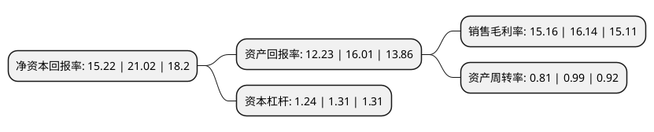

> 本页面由自动化程序生成于 2022年5月20日 01:40
> 内容可能存在错误，如有bug请提交issue至：https://github.com/Eroleice/doc-pi/issues
{.is-warning}

# 上市公司基本情况

## 基本资料

江苏德源药业股份有限公司（以下简称“德源药业”）成立于2004年10月29日，连云港市。于2021年02月19日在北交所北交所上市。

德源药业注册资本6,528.6万元，主要产品包括盐酸吡格列酮片，那格列奈片，吡格列酮二甲双胍片，坎地氢噻片，盐酸二甲双胍缓释片，甲钴胺胶囊以及盐酸吡格列酮，那格列奈，苯甲酸阿格列汀，安立生坦原料药等。以下是详细信息：

- 公司名称: 江苏德源药业股份有限公司
- 股票代码: 832735.BJ
- 所在地: 江苏 - 连云港市
- 成立日期: 2004年10月29日
- 注册资本: 6,528.6万元
- 法定代表人: 李永安
- 主营业务: 主要产品包括盐酸吡格列酮片，那格列奈片，吡格列酮二甲双胍片，坎地氢噻片，盐酸二甲双胍缓释片，甲钴胺胶囊以及盐酸吡格列酮，那格列奈，苯甲酸阿格列汀，安立生坦原料药等
- 公司官网: www.pharmdy.com
- 公司介绍: 公司专业从事内分泌、心血管等疾病治疗药物及其原料药的研发、生产和销售,并于2013年通过新版GMP认证。公司坚持“以特色求发展”的发展战略，致力于不断提高“三高(高血糖、高血脂、高血压)”人群的健康水平和生活质量。目前销售的品种有：国家1类新药“瑞彤”(盐酸吡格列酮片)；国家2类新药“唐瑞”(那格列奈片)；国家3类新药“复瑞彤”(吡格列酮二甲双胍片)、“波开清”(坎地氢噻片)、盐酸二甲双胍缓释片、甲钴胺胶囊等。其中，“波开清”为国内独家开发、“复瑞彤”为国内首研。德源早期产品“瑞彤”、“唐瑞”质量和疗效得到社会的广泛认可。

## 股东及高管情况

上市公司第一大股东为天津药物研究院有限公司，持股6,300,000股，占比9.65%，**疑似为**上市公司实际控制人。

截至2022年03月31日，上市公司的前十大股东中，共有9名自然人股东，1名机构股东，其中5%以上大股东共有6名。上市公司前十大股东明细如下：

> 未能通过持股比例判定出上市公司实际控制人（持股30%以上）
> 可能存在通过间接持股、联合持股、协议控制等方式拥有实际控制权的主体，具体请参考上市公司定期公告！
{.is-warning}

> 上市公司第一大股东持股不超过10%，请检查是否存在公司控制权风险！
{.is-danger}

> 截至2022年03月31日，上市公司前十大股东信息如下：

| 股东名称 | 持股数量（股） | 持股比例 |
| --- | --- | --- |
| 天津药物研究院有限公司 | 6,300,000 | 9.65% |
| 徐维钰 | 4,201,000 | 6.43% |
| 陈学民 | 4,200,000 | 6.43% |
| 任路 | 3,791,000 | 5.81% |
| 徐根华 | 3,387,000 | 5.19% |
| 范世忠 | 3,360,000 | 5.15% |
| 郑家通 | 2,800,000 | 4.29% |
| 张作连 | 1,761,000 | 2.7% |
| 何建忠 | 1,680,000 | 2.57% |
| 孙玉声 | 1,680,000 | 2.57% |

## 利润表分析

上市公司2021年总收入为5.13亿元，净利润为0.77亿元，实现盈利。

## 杜邦分析

> 数据列示周期：2021年 | 2020年 | 2019年
{.is-info}

上市公司的净资产收益率在近一年有所下降，下降幅度为-27.59%，其变化情况分解如下：
- 上市公司的销售毛利率在近一年下降了-6.07%，可能是生产效率的下降、商品原材料价格上涨或商品价格的下跌所致。
- 上市公司的资产周转率在近一年下降了-18.18%，可能是源自于更慢的销售回款或库存管理效果下降。
- 上市公司的财务杠杆比率在近一年下降了-5.34%，可能是减少负债降低财务费用。

