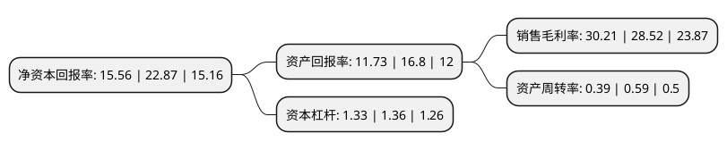

> 本页面由自动化程序生成于 2022年5月20日 01:41
> 内容可能存在错误，如有bug请提交issue至：https://github.com/Eroleice/doc-pi/issues
{.is-warning}

# 上市公司基本情况

## 基本资料

桂林星辰科技股份有限公司（以下简称“星辰科技”）成立于2008年10月28日，桂林市。于2021年07月08日在北交所北交所上市。

星辰科技注册资本8,570.9万元，智能制造装备及其关键功能部件的研发，生产和销售以下是详细信息：

- 公司名称: 桂林星辰科技股份有限公司
- 股票代码: 832885.BJ
- 所在地: 广西 - 桂林市
- 成立日期: 2008年10月28日
- 注册资本: 8,570.9万元
- 法定代表人: 吕虹
- 主营业务: 智能制造装备及其关键功能部件的研发，生产和销售
- 公司官网: www.stars.com.cn
- 公司介绍: 公司是一家民营军工企业，具备完整的军工资质，为航天/军工、新能源以及工业自动化领域提供各类高端伺服系统、智能控制系统。公司集伺服电机、伺服驱动器、智能控制系统的研发、生产、销售、服务于一体，既可满足批量供货，也可响应个性化定制。公司多年来致力于伺服控制、伺服电机、电磁兼容、消隙控制、装备智能化控制，产品多次服务于国家重点工程，如“天宫”、“神舟”系列飞船测控、发射系统、火炮控制、雷达、卫星通讯等。公司另有工业级产品服务于风电变桨、新能源车、液压伺服、机器人等工业自动化等领域。

## 股东及高管情况

上市公司第一大股东为桂林星辰电力电子有限公司，持股30,440,050股，占比35.5156%，为上市公司实际控制人。

截至2022年03月31日，上市公司的前十大股东中，共有8名自然人股东，2名机构股东，其中5%以上大股东共有4名。上市公司前十大股东明细如下：

> 截至2022年03月31日，上市公司前十大股东信息如下：

| 股东名称 | 持股数量（股） | 持股比例 |
| --- | --- | --- |
| 桂林星辰电力电子有限公司 | 30,440,050 | 35.5156% |
| 吕虹 | 6,642,864 | 7.7505% |
| 丘斌 | 5,911,834 | 6.8976% |
| 马锋 | 4,957,200 | 5.7838% |
| 吕爱群 | 2,937,235 | 3.427% |
| 刘群 | 2,120,494 | 2.4741% |
| 包江华 | 1,937,040 | 2.26% |
| 吴勇强 | 1,810,682 | 2.1126% |
| 周江 | 1,748,130 | 2.0396% |
| 江海证券有限公司 | 1,312,003 | 1.5308% |

## 利润表分析

上市公司2021年总收入为1.41亿元，净利润为0.42亿元，实现盈利。

## 杜邦分析

> 数据列示周期：2021年 | 2020年 | 2019年
{.is-info}

上市公司的净资产收益率在近一年有所下降，下降幅度为-31.96%，其变化情况分解如下：
- 上市公司的销售毛利率在近一年上升了5.93%，可能是生产效率的提升、商品原材料价格下跌或商品价格的上涨所致。
- 上市公司的资产周转率在近一年下降了-33.9%，可能是源自于更慢的销售回款或库存管理效果下降。
- 上市公司的财务杠杆比率在近一年下降了-2.21%，可能是减少负债降低财务费用。

