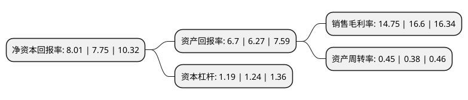

> 本页面由自动化程序生成于 2022年5月20日 01:41
> 内容可能存在错误，如有bug请提交issue至：https://github.com/Eroleice/doc-pi/issues
{.is-warning}

# 上市公司基本情况

## 基本资料

云南生物谷药业股份有限公司（以下简称“生物谷”）成立于1999年06月13日，昆明市。于2020年07月27日在北交所北交所上市。

生物谷注册资本12,800万元，公司专业从事以植物药为主的药品，保健品的研发，生产及市场营销，以灯盏花系列产品为主，已上市产品有灯盏生脉胶囊，灯盏细辛注射液，灯盏细辛胶囊，灯盏花素片，灯盏花滴丸以下是详细信息：

- 公司名称: 云南生物谷药业股份有限公司
- 股票代码: 833266.BJ
- 所在地: 云南 - 昆明市
- 成立日期: 1999年06月13日
- 注册资本: 12,800万元
- 法定代表人: 林艳和
- 主营业务: 公司专业从事以植物药为主的药品，保健品的研发，生产及市场营销，以灯盏花系列产品为主，已上市产品有灯盏生脉胶囊，灯盏细辛注射液，灯盏细辛胶囊，灯盏花素片，灯盏花滴丸
- 公司官网: www.biovalley.cn
- 公司介绍: 公司主要从事于灯盏花系列药品的研发、生产与销售，主要产品以灯盏花为基础原料，运用现代精深加工技术实现灯盏花有效成分在药用领域的产业化应用，主要产品灯盏生脉胶囊和灯盏细辛注射液为治疗心脑血管疾病的中成药。具特色的是灯盏细辛系列产品，以灯盏生脉胶囊、灯盏细辛注射液为主导产品。公司拥有较强的技术研发和创新能力，并一贯重视对技术创新和研发的投入。在生产过程中，质量部门对生产全过程进行监督，对原辅料、中间产品、待包装产品和产成品的质量进行全程检测和监控。

## 股东及高管情况

上市公司第一大股东为深圳市金沙江投资有限公司，持股30,000,000股，占比23.44%，**疑似为**上市公司实际控制人。

截至2022年03月31日，上市公司的前十大股东中，共有7名自然人股东，1名机构股东，2个产品账户，其中5%以上大股东共有3名。上市公司前十大股东明细如下：

> 未能通过持股比例判定出上市公司实际控制人（持股30%以上）
> 可能存在通过间接持股、联合持股、协议控制等方式拥有实际控制权的主体，具体请参考上市公司定期公告！
{.is-warning}

> 截至2022年03月31日，上市公司前十大股东信息如下：

| 股东名称 | 持股数量（股） | 持股比例 |
| --- | --- | --- |
| 深圳市金沙江投资有限公司 | 30,000,000 | 23.44% |
| 林艳和 | 21,550,000 | 16.84% |
| 谭想芳 | 6,500,000 | 5.08% |
| 云南生物谷药业股份有限公司回购专用证券账户 | 3,999,993 | 3.13% |
| 张志雄 | 2,463,366 | 1.92% |
| 张牡芳 | 2,215,333 | 1.73% |
| 吴佑辉 | 2,000,000 | 1.56% |
| 上海展瑞新富股权投资基金管理有限公司-展瑞新富金猴1号生物谷定增私募股权投资基金 | 1,780,000 | 1.39% |
| 高念武 | 1,473,000 | 1.15% |
| 刘伟 | 1,420,000 | 1.11% |

## 利润表分析

上市公司2021年总收入为5.66亿元，净利润为0.83亿元，实现盈利。

## 杜邦分析

> 数据列示周期：2021年 | 2020年 | 2019年
{.is-info}

上市公司的净资产收益率在近一年有所上升，上升幅度为3.35%，其变化情况分解如下：
- 上市公司的销售毛利率在近一年下降了-11.14%，可能是生产效率的下降、商品原材料价格上涨或商品价格的下跌所致。
- 上市公司的资产周转率在近一年上升了18.42%，可能是源自于更快的销售回款或库存管理效果提升。
- 上市公司的财务杠杆比率在近一年下降了-4.03%，可能是减少负债降低财务费用。

