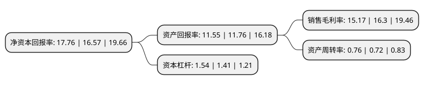

> 本页面由自动化程序生成于 2022年5月20日 01:41
> 内容可能存在错误，如有bug请提交issue至：https://github.com/Eroleice/doc-pi/issues
{.is-warning}

# 上市公司基本情况

## 基本资料

上海威贸电子股份有限公司（以下简称“威贸电子”）成立于1998年06月23日，上海市。于2022年02月23日在北交所北交所上市。

威贸电子注册资本7,792.665万元，研发，生产，销售各类线束组件及注塑集成件以下是详细信息：

- 公司名称: 上海威贸电子股份有限公司
- 股票代码: 833346.BJ
- 所在地: 上海 - 上海市
- 成立日期: 1998年06月23日
- 注册资本: 7,792.665万元
- 法定代表人: 周豪良
- 主营业务: 研发，生产，销售各类线束组件及注塑集成件
- 公司官网: www.shwmdz.com
- 公司介绍: 公司前身上海威贸电子有限公司，是一家集研发、生产、销售、服务于一体的民营综合型企业。专业生产各类电子线束、注塑产品、电感线圈、PCBA电子线路板以及代理销售世界品牌连接器。公司于2000年就已通过ISO9001-2000质量体系认证、ISO14001国际绿色环保认证、TS16949汽车体系认证和美国UL认证。产品也均符合相关行业标准以及欧盟ROHS标准。公司一贯以技术创新为核心；以研发新项目、开发新产品为目标；采用网上销售模式，在全球知名搜索网站上均有搜索关键词，销售范围覆盖全球。公司凭借广泛的采购网络、充足的原厂货源、强大的售后服务系统为基础，能够全方位保证实现客户的最大利益。

## 股东及高管情况

上市公司第一大股东为周豪良，持股34,136,000股，占比42.31%，为上市公司实际控制人。

截至2022年03月31日，上市公司的前十大股东中，共有5名自然人股东，4名机构股东，1个产品账户，其中5%以上大股东共有3名。上市公司前十大股东明细如下：

> 截至2022年03月31日，上市公司前十大股东信息如下：

| 股东名称 | 持股数量（股） | 持股比例 |
| --- | --- | --- |
| 周豪良 | 34,136,000 | 42.31% |
| 高建珍 | 9,926,000 | 12.3% |
| 上海威贸投资管理有限公司 | 4,948,000 | 6.13% |
| 荀逸中 | 2,606,187 | 3.23% |
| 周威迪 | 2,024,000 | 2.51% |
| 深圳市丹桂顺资产管理有限公司 | 756,000 | 0.94% |
| 晨鸣(青岛)资产管理有限公司-重信晨融(青岛)私募股权投资基金合伙企业(有限合伙) | 716,000 | 0.89% |
| 宏源汇富创业投资有限公司 | 666,000 | 0.83% |
| 淄博威贸投资合伙企业(有限合伙) | 600,000 | 0.74% |
| 邱静 | 457,340 | 0.57% |

## 利润表分析

上市公司2021年总收入为2.22亿元，净利润为0.33亿元，实现盈利。

## 杜邦分析

> 数据列示周期：2021年 | 2020年 | 2019年
{.is-info}

上市公司的净资产收益率在近一年有所上升，上升幅度为7.18%，其变化情况分解如下：
- 上市公司的销售毛利率在近一年下降了-6.93%，可能是生产效率的下降、商品原材料价格上涨或商品价格的下跌所致。
- 上市公司的资产周转率在近一年上升了5.56%，可能是源自于更快的销售回款或库存管理效果提升。
- 上市公司的财务杠杆比率在近一年上升了9.22%，可能是增加负债扩大生产规模。

