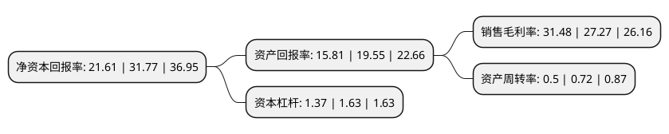

> 本页面由自动化程序生成于 2022年5月20日 01:41
> 内容可能存在错误，如有bug请提交issue至：https://github.com/Eroleice/doc-pi/issues
{.is-warning}

# 上市公司基本情况

## 基本资料

华维设计集团股份有限公司（以下简称“华维设计”）成立于2000年10月12日，南昌市。于2021年02月05日在北交所北交所上市。

华维设计注册资本8,247.6万元，工程设计及咨询以下是详细信息：

- 公司名称: 华维设计集团股份有限公司
- 股票代码: 833427.BJ
- 所在地: 江西 - 南昌市
- 成立日期: 2000年10月12日
- 注册资本: 8,247.6万元
- 法定代表人: 廖宜强
- 主营业务: 工程设计及咨询
- 公司官网: www.tjsjjt.com
- 公司介绍: 公司是一家提供道路、桥梁、建筑、风景园林、城市规划、亮化等工程设计服务及多行业工程咨询服务(包括为公路、市政公用、建筑、医药、轻工、农业等行业编制项目建议书、可行性研究报告、申请报告、资金申请、规划咨询、评估咨询、招投标咨询等)的专业化公司。

## 股东及高管情况

上市公司第一大股东为廖宜勤，持股25,915,047股，占比31.42%，为上市公司实际控制人。

截至2022年03月31日，上市公司的前十大股东中，共有6名自然人股东，4名机构股东，其中5%以上大股东共有5名。上市公司前十大股东明细如下：

> 截至2022年03月31日，上市公司前十大股东信息如下：

| 股东名称 | 持股数量（股） | 持股比例 |
| --- | --- | --- |
| 廖宜勤 | 25,915,047 | 31.42% |
| 共青城宽德立投资管理中心(有限合伙) | 10,150,000 | 12.31% |
| 新余道勤投资管理中心(有限合伙) | 8,700,000 | 10.55% |
| 共青城正道投资管理合伙企业(有限合伙) | 8,700,000 | 10.55% |
| 廖宜强 | 6,481,109 | 7.86% |
| 昌建建设集团有限公司 | 3,123,800 | 3.79% |
| 廖宜勇 | 1,305,000 | 1.58% |
| 张云林 | 870,000 | 1.05% |
| 朱玉琴 | 583,547 | 0.71% |
| 侯昌星 | 290,000 | 0.35% |

## 利润表分析

上市公司2021年总收入为1.8亿元，净利润为0.56亿元，实现盈利。

## 杜邦分析

> 数据列示周期：2021年 | 2020年 | 2019年
{.is-info}

上市公司的净资产收益率在近一年有所下降，下降幅度为-31.98%，其变化情况分解如下：
- 上市公司的销售毛利率在近一年上升了15.44%，可能是生产效率的提升、商品原材料价格下跌或商品价格的上涨所致。
- 上市公司的资产周转率在近一年下降了-30.56%，可能是源自于更慢的销售回款或库存管理效果下降。
- 上市公司的财务杠杆比率在近一年下降了-15.95%，可能是减少负债降低财务费用。

