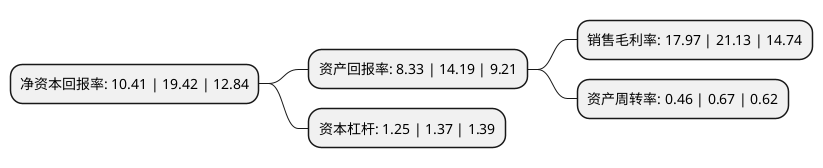

> 本页面由自动化程序生成于 2022年5月20日 01:41
> 内容可能存在错误，如有bug请提交issue至：https://github.com/Eroleice/doc-pi/issues
{.is-warning}

# 上市公司基本情况

## 基本资料

河南同心传动股份有限公司（以下简称“同心传动”）成立于2001年09月30日，许昌市。于2021年11月15日在北交所北交所上市。

同心传动注册资本10,510万元，汽车传动轴，机械配件的生产，销售。以下是详细信息：

- 公司名称: 河南同心传动股份有限公司
- 股票代码: 833454.BJ
- 所在地: 河南 - 许昌市
- 成立日期: 2001年09月30日
- 注册资本: 10,510万元
- 法定代表人: 陈红凯
- 主营业务: 汽车传动轴，机械配件的生产，销售
- 公司官网: www.hntxcd.com
- 公司介绍: 公司(原许昌万向汽车传动轴有限公司)创建于2001年，坐落于许昌市民营科技园北园，占地面积80000平方米，2015年迁至许昌市经济技术开发区长庆街南侧，是专业研发制造各类汽车转向装置传动轴的大型企业。主要为轻、中、重及特种汽车、工程机械、轧钢机械、内燃机等产品配套。产品吸收德、美、日等国先进技术，设计新颖，性能稳定，畅销国内外，是同行业中生产周期最短，品种最齐全，服务最到位的专业化生产厂家。

## 股东及高管情况

上市公司第一大股东为陈红凯，持股55,794,500股，占比53.09%，为上市公司实际控制人。

截至2022年03月31日，上市公司的前十大股东中，共有5名自然人股东，5名机构股东，其中5%以上大股东共有2名。上市公司前十大股东明细如下：

> 截至2022年03月31日，上市公司前十大股东信息如下：

| 股东名称 | 持股数量（股） | 持股比例 |
| --- | --- | --- |
| 陈红凯 | 55,794,500 | 53.09% |
| 刘倩 | 6,202,500 | 5.9% |
| 陈玉红 | 4,030,000 | 3.83% |
| 李宏杰 | 3,999,000 | 3.8% |
| 艾俊锋 | 2,770,299 | 2.64% |
| 杭州奥赢投资合伙企业(有限合伙) | 681,820 | 0.65% |
| 北京金长川资本管理有限公司-嘉兴金长川贰号股权投资合伙企业(有限合伙) | 681,819 | 0.65% |
| 上海冠通投资有限公司 | 681,819 | 0.65% |
| 深圳开源证券投资有限公司 | 454,545 | 0.43% |
| 首正泽富创新投资(北京)有限公司 | 454,545 | 0.43% |

## 利润表分析

上市公司2021年总收入为1.32亿元，净利润为0.23亿元，实现盈利。

## 杜邦分析

> 数据列示周期：2021年 | 2020年 | 2019年
{.is-info}

上市公司的净资产收益率在近一年有所下降，下降幅度为-46.4%，其变化情况分解如下：
- 上市公司的销售毛利率在近一年下降了-14.96%，可能是生产效率的下降、商品原材料价格上涨或商品价格的下跌所致。
- 上市公司的资产周转率在近一年下降了-31.34%，可能是源自于更慢的销售回款或库存管理效果下降。
- 上市公司的财务杠杆比率在近一年下降了-8.76%，可能是减少负债降低财务费用。

