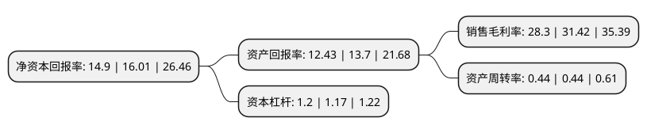

> 本页面由自动化程序生成于 2022年5月20日 01:41
> 内容可能存在错误，如有bug请提交issue至：https://github.com/Eroleice/doc-pi/issues
{.is-warning}

# 上市公司基本情况

## 基本资料

常州同惠电子股份有限公司（以下简称“同惠电子”）成立于1994年04月29日，常州市。于2021年01月11日在北交所北交所上市。

同惠电子注册资本10,620.311万元，元件参数测试仪器，绕线元件测试仪器，电气安规测试仪器，电阻类测试仪器，电力电子测试仪器，台式数字多用表等电子测试与测量仪器的研发，生产，销售和技术服务以下是详细信息：

- 公司名称: 常州同惠电子股份有限公司
- 股票代码: 833509.BJ
- 所在地: 江苏 - 常州市
- 成立日期: 1994年04月29日
- 注册资本: 10,620.311万元
- 法定代表人: 赵浩华
- 主营业务: 元件参数测试仪器，绕线元件测试仪器，电气安规测试仪器，电阻类测试仪器，电力电子测试仪器，台式数字多用表等电子测试与测量仪器的研发，生产，销售和技术服务
- 公司官网: www.tonghui.com.cn
- 公司介绍: 公司成立于1999年，公司主营业务是各种电子测试与测毋仪器的设计、研发、生产、销售和技术服务，以及解决方案的提供和实施，公司主要产品是元器件参数测试仪器：变压器、电机、线圏类测试仪：电气安规测试仪：电阻类测试仪器等电子测试仪器产品。公司产品广泛应用于工业电子制造、教育科研、通讯、军工和电力等领域，公司成立以来,一直致力于电子测试与测量仪器产品及技术的研发，绝大部分产品依赖自主研发与生产，在积累一定的行业和技术经验后，逐渐创立了自主品牌.近几年实现业务快速成长。公司已成为拥有自主知识产权的高新技术企业，是业内电子测试与测试仪器行业中产品线较全、品质较高、信誉良好的民族品牌电子测试设备制造商。

## 股东及高管情况

上市公司第一大股东为赵浩华，持股13,457,400股，占比12.67%，**疑似为**上市公司实际控制人。

截至2022年03月31日，上市公司的前十大股东中，共有9名自然人股东，1名机构股东，其中5%以上大股东共有7名。上市公司前十大股东明细如下：

> 未能通过持股比例判定出上市公司实际控制人（持股30%以上）
> 可能存在通过间接持股、联合持股、协议控制等方式拥有实际控制权的主体，具体请参考上市公司定期公告！
{.is-warning}

> 截至2022年03月31日，上市公司前十大股东信息如下：

| 股东名称 | 持股数量（股） | 持股比例 |
| --- | --- | --- |
| 赵浩华 | 13,457,400 | 12.67% |
| 王志平 | 10,017,000 | 9.43% |
| 孙伯乐 | 9,135,000 | 8.6% |
| 高志齐 | 9,135,000 | 8.6% |
| 任老二 | 9,135,000 | 8.6% |
| 王恒斌 | 9,135,000 | 8.6% |
| 唐玥 | 6,363,000 | 5.99% |
| 袁萍 | 3,189,080 | 3% |
| 常州同达实业投资合伙企业(有限合伙) | 2,700,000 | 2.54% |
| 夏军兰 | 2,245,076 | 2.11% |

## 利润表分析

上市公司2021年总收入为1.47亿元，净利润为0.41亿元，实现盈利。

## 杜邦分析

> 数据列示周期：2021年 | 2020年 | 2019年
{.is-info}

上市公司的净资产收益率在近一年有所下降，下降幅度为-6.93%，其变化情况分解如下：
- 上市公司的销售毛利率在近一年下降了-9.93%，可能是生产效率的下降、商品原材料价格上涨或商品价格的下跌所致。
- 上市公司的资产周转率在近一年下降了0%，可能是源自于更慢的销售回款或库存管理效果下降。
- 上市公司的财务杠杆比率在近一年上升了2.56%，可能是增加负债扩大生产规模。

