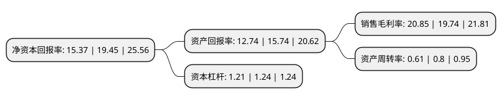

> 本页面由自动化程序生成于 2022年5月20日 01:41
> 内容可能存在错误，如有bug请提交issue至：https://github.com/Eroleice/doc-pi/issues
{.is-warning}

# 上市公司基本情况

## 基本资料

惠州市惠德瑞锂电科技股份有限公司（以下简称“德瑞锂电”）成立于2012年05月07日，惠州市。于2021年06月03日在北交所北交所上市。

德瑞锂电注册资本7,792.413万元，锂锰电池，锂铁电池等锂一次电池产品的研发，生产和销售以下是详细信息：

- 公司名称: 惠州市惠德瑞锂电科技股份有限公司
- 股票代码: 833523.BJ
- 所在地: 广东 - 惠州市
- 成立日期: 2012年05月07日
- 注册资本: 7,792.413万元
- 法定代表人: 潘文硕
- 主营业务: 锂锰电池，锂铁电池等锂一次电池产品的研发，生产和销售
- 公司官网: www.huiderui.com
- 公司介绍: 公司专注于从事锂锰电池、锂铁电池等锂一次电池产品的研发、生产和销售，提供整体解决方案，产品广泛涵盖了智能仪表、安防产品、GPS追踪器、射频等领域。公司是国内知名的锂锰电池、锂铁电池产品专业制造商。公司具有完善的管理体系，公司拥有优质的客户资源，先后通过了多家国内知名品牌企业的体系审核，成为多家国内外知名企业的长期合作的供应商。

## 股东及高管情况

上市公司第一大股东为艾建杰，持股11,758,260股，占比15.0894%，**疑似为**上市公司实际控制人。

截至2022年04月21日，上市公司的前十大股东中，共有10名自然人股东，其中5%以上大股东共有3名。上市公司前十大股东明细如下：

> 未能通过持股比例判定出上市公司实际控制人（持股30%以上）
> 可能存在通过间接持股、联合持股、协议控制等方式拥有实际控制权的主体，具体请参考上市公司定期公告！
{.is-warning}

> 截至2022年04月21日，上市公司前十大股东信息如下：

| 股东名称 | 持股数量（股） | 持股比例 |
| --- | --- | --- |
| 艾建杰 | 11,758,260 | 15.0894% |
| 潘文硕 | 10,383,920 | 13.3257% |
| 刘秋明 | 7,302,623 | 9.3715% |
| 何献文 | 2,811,189 | 3.6076% |
| 张健 | 2,707,310 | 3.4743% |
| 周文建 | 2,101,911 | 2.6974% |
| 谢晖 | 1,625,998 | 2.0866% |
| 王瑞钧 | 1,317,911 | 1.6913% |
| 王卫华 | 1,317,911 | 1.6913% |
| 王之平 | 1,317,909 | 1.6913% |

## 利润表分析

上市公司2021年总收入为2.21亿元，净利润为0.46亿元，实现盈利。

## 杜邦分析

> 数据列示周期：2021年 | 2020年 | 2019年
{.is-info}

上市公司的净资产收益率在近一年有所下降，下降幅度为-20.98%，其变化情况分解如下：
- 上市公司的销售毛利率在近一年上升了5.62%，可能是生产效率的提升、商品原材料价格下跌或商品价格的上涨所致。
- 上市公司的资产周转率在近一年下降了-23.75%，可能是源自于更慢的销售回款或库存管理效果下降。
- 上市公司的财务杠杆比率在近一年下降了-2.42%，可能是减少负债降低财务费用。

