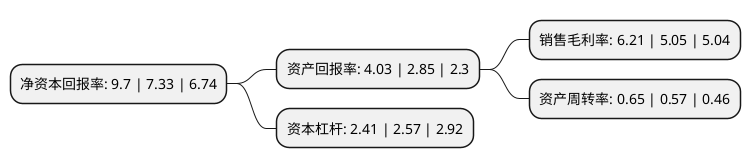

> 本页面由自动化程序生成于 2022年5月20日 01:41
> 内容可能存在错误，如有bug请提交issue至：https://github.com/Eroleice/doc-pi/issues
{.is-warning}

# 上市公司基本情况

## 基本资料

北京颖泰嘉和生物科技股份有限公司（以下简称“颖泰生物”）成立于2005年07月01日，北京市。于2020年07月27日在北交所北交所上市。

颖泰生物注册资本122,580万元，农药中间体，原药及制剂的研发，生产，销售，GLP登记注册技术服务收入和生物技术研究开发。以下是详细信息：

- 公司名称: 北京颖泰嘉和生物科技股份有限公司
- 股票代码: 833819.BJ
- 所在地: 北京 - 北京市
- 成立日期: 2005年07月01日
- 注册资本: 122,580万元
- 法定代表人: 王榕
- 主营业务: 农药中间体，原药及制剂的研发，生产，销售，GLP登记注册技术服务收入和生物技术研究开发
- 公司官网: www.nutrichem.cn
- 公司介绍: 公司是以研发为基础、以市场需求为先导的农化产品供应商，主营业务为农药原药、中间体及制剂产品的研发、生产、销售和GLP技术服务。公司自成立以来秉持“担当、创新、协作”的核心价值观，以“让农化更好地服务于社会”为使命，经过多年的积累和创新，已形成品种丰富、工艺技术较为先进的除草剂、杀菌剂、杀虫剂三大品类百余种高品质产品，服务于ADAMA(安道麦)、CORTEVA(科迪华)、NUFARM(纽发姆)、LANXESS(朗盛)等众多全球大型植物保护跨国公司。

## 股东及高管情况

上市公司第一大股东为华邦生命健康股份有限公司，持股561,683,154股，占比45.82%，为上市公司实际控制人。

截至2022年03月31日，上市公司的前十大股东中，共有4名自然人股东，6名机构股东，其中5%以上大股东共有2名。上市公司前十大股东明细如下：

> 截至2022年03月31日，上市公司前十大股东信息如下：

| 股东名称 | 持股数量（股） | 持股比例 |
| --- | --- | --- |
| 华邦生命健康股份有限公司 | 561,683,154 | 45.82% |
| 浙江新安化工集团股份有限公司 | 150,950,000 | 12.31% |
| 浙农合泰(杭州)企业管理合伙企业(有限合伙) | 40,000,000 | 3.26% |
| 北京鸿泰嘉业咨询中心(有限合伙) | 28,389,353 | 2.32% |
| 王榕 | 23,639,000 | 1.93% |
| 蒋康伟 | 18,456,406 | 1.51% |
| 北京和睿嘉业投资中心(有限合伙) | 18,312,000 | 1.49% |
| 姚秀琴 | 15,457,144 | 1.26% |
| 卓远汇医投资有限公司 | 15,242,500 | 1.24% |
| 周庆雷 | 15,031,000 | 1.23% |

## 利润表分析

上市公司2021年总收入为73.53亿元，净利润为4.56亿元，实现盈利。

## 杜邦分析

> 数据列示周期：2021年 | 2020年 | 2019年
{.is-info}

上市公司的净资产收益率在近一年有所上升，上升幅度为32.33%，其变化情况分解如下：
- 上市公司的销售毛利率在近一年上升了22.97%，可能是生产效率的提升、商品原材料价格下跌或商品价格的上涨所致。
- 上市公司的资产周转率在近一年上升了14.04%，可能是源自于更快的销售回款或库存管理效果提升。
- 上市公司的财务杠杆比率在近一年下降了-6.23%，可能是减少负债降低财务费用。

