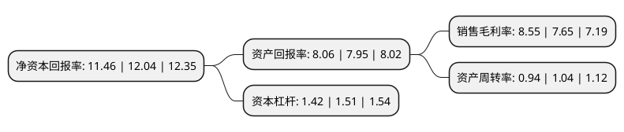

> 本页面由自动化程序生成于 2022年5月20日 01:41
> 内容可能存在错误，如有bug请提交issue至：https://github.com/Eroleice/doc-pi/issues
{.is-warning}

# 上市公司基本情况

## 基本资料

北京流金岁月传媒科技股份有限公司（以下简称“流金岁月”）成立于2011年07月22日，北京市。于2020年07月27日在北交所北交所上市。

流金岁月注册资本31,499.998万元，电视频道综合运营服务以下是详细信息：

- 公司名称: 北京流金岁月传媒科技股份有限公司
- 股票代码: 834021.BJ
- 所在地: 北京 - 北京市
- 成立日期: 2011年07月22日
- 注册资本: 31,499.998万元
- 法定代表人: 王俭
- 主营业务: 电视频道综合运营服务
- 公司官网: www.bjljsy.com
- 公司介绍: 公司是一家电视频道综合运营服务商，主要提供卫星电视直播信号落地入网覆盖服务。(含专业卫星数字接收机研发及销售、电视剧发行、电视节目营销、电视广告代理等衍生业务)公司处于视听行业，属于电视+互联网领域，作为一家高新技术企业，利用自身的专业加密卫星接收技术，配合渠道决策分析技术，能有效降低覆盖渠道成本，扩充覆盖渠道，在获得大量卫视客户的认可后，产生了卫视客户的规模效应，又进一步掌握了渠道成本的议价能力。公司在卫视覆盖预算与实际渠道执行成本的价差中获得利润。在国家的政策支持下，三网融合推进迅速，公司业务从原有的单一的广电有线网络公司渠道扩充到交互式网络电视(IPTV)渠道和互联网电视(OTT TV)渠道。

## 股东及高管情况

上市公司第一大股东为王俭，持股70,736,761股，占比22.46%，**疑似为**上市公司实际控制人。

截至2022年03月31日，上市公司的前十大股东中，共有4名自然人股东，4名机构股东，2个产品账户，其中5%以上大股东共有3名。上市公司前十大股东明细如下：

> 未能通过持股比例判定出上市公司实际控制人（持股30%以上）
> 可能存在通过间接持股、联合持股、协议控制等方式拥有实际控制权的主体，具体请参考上市公司定期公告！
{.is-warning}

> 截至2022年03月31日，上市公司前十大股东信息如下：

| 股东名称 | 持股数量（股） | 持股比例 |
| --- | --- | --- |
| 王俭 | 70,736,761 | 22.46% |
| 上海御米投资管理合伙企业(有限合伙) | 17,267,646 | 5.48% |
| 上海流联投资管理合伙企业(有限合伙) | 16,495,146 | 5.24% |
| 熊玉国 | 11,860,147 | 3.77% |
| 孙潇 | 10,860,440 | 3.45% |
| 海南省文化体育产业发展基金(有限合伙) | 9,088,235 | 2.89% |
| 山东江诣创业投资有限公司 | 7,312,394 | 2.32% |
| 罗欢 | 7,270,588 | 2.31% |
| 北京流金岁月文化传播股份有限公司回购专用证券账户 | 6,000,000 | 1.9% |
| 北京天星开元投资中心(有限合伙) | 4,231,861 | 1.34% |

## 利润表分析

上市公司2021年总收入为8.5亿元，净利润为0.72亿元，实现盈利。

## 杜邦分析

> 数据列示周期：2021年 | 2020年 | 2019年
{.is-info}

上市公司的净资产收益率在近一年有所下降，下降幅度为-4.82%，其变化情况分解如下：
- 上市公司的销售毛利率在近一年上升了11.76%，可能是生产效率的提升、商品原材料价格下跌或商品价格的上涨所致。
- 上市公司的资产周转率在近一年下降了-9.62%，可能是源自于更慢的销售回款或库存管理效果下降。
- 上市公司的财务杠杆比率在近一年下降了-5.96%，可能是减少负债降低财务费用。

